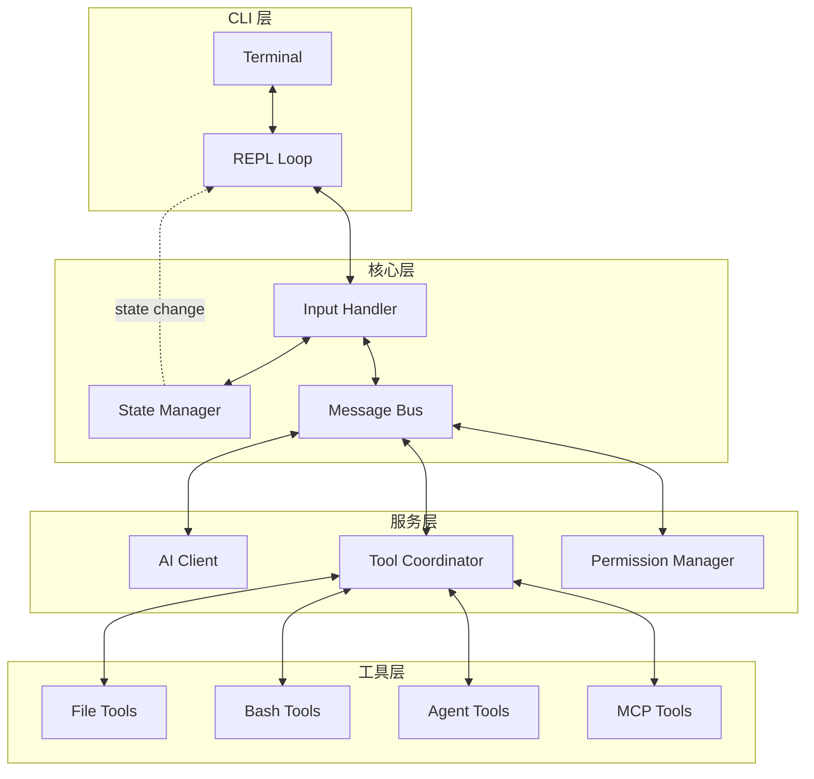
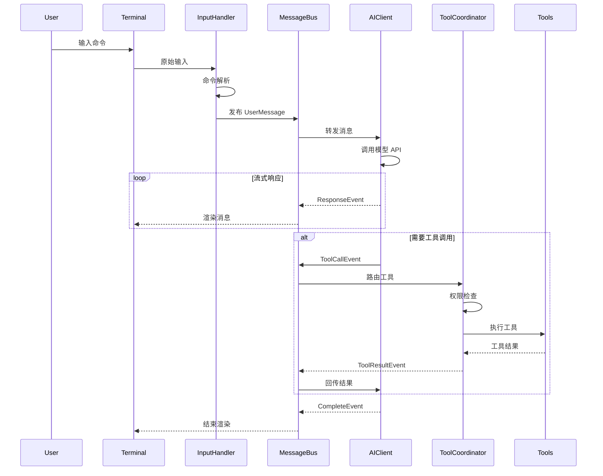
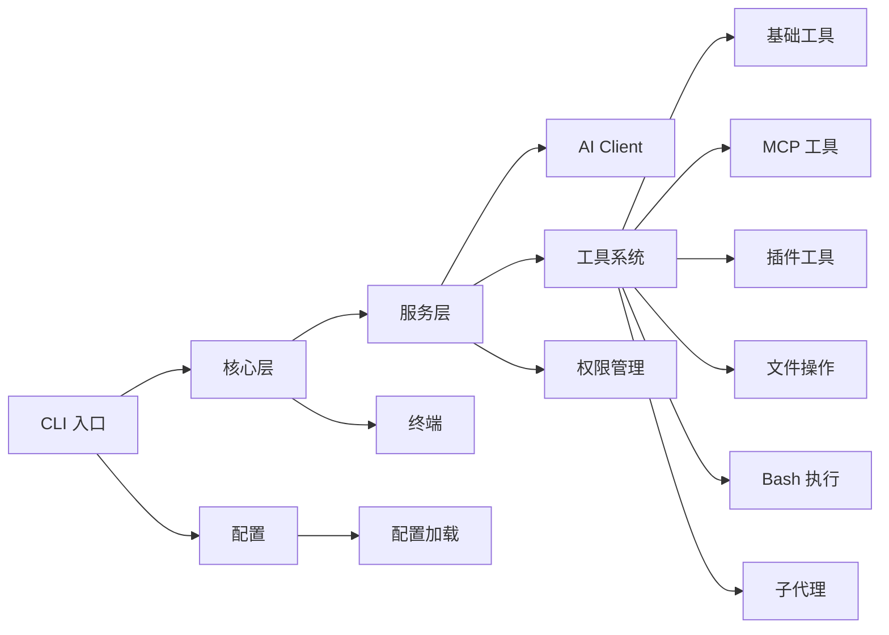

# CrabCoder 开发文档

> AI 编程助手的 Go 语言实现

---

## 目录

- [项目概述](#项目概述)
- [设计原则](#设计原则)
- [核心架构](#核心架构)
- [模块设计](#模块设计)
- [设计模式](#设计模式)
- [API 接口](#api-接口)
- [目录结构](#目录结构)
- [配置文件](#配置文件)
- [多模型支持](#多模型支持)
- [历史对话管理](#历史对话管理)
- [CLI/TUI 框架选型](#clitui-框架选型)

---

## 项目概述

### 项目定位

CrabCoder 是一个基于 Go 语言实现的 AI 编程助手 CLI 工具，通过终端界面与用户交互，调用 AI 模型完成代码生成、文件编辑、命令执行等编程任务。

### 目标用户

| 用户群体 | 使用场景 | 核心需求 |
|---------|---------|---------|
| 后端开发者 | API 开发、数据库操作、微服务 | 代码生成、SQL 编写、API 调试 |
| 前端开发者 | React/Vue 组件、尿点样式 | UI 组件生成、CSS 编写、调试 |
| 全栈开发者 | 前后端集成、配置管理 | 跨栈开发、统一交互界面 |
| DevOps | 脚本编写、CI/CD 配置 | Shell 脚本、Dockerfile、配置 |
| 学生/初学者 | 学习编程、代码学习 | 解释代码、生成示例、答疑解惑 |

### 支持平台

| 平台 | 支持状态 | 说明 |
|------|---------|------|
| macOS | ✅ 完全支持 | 首选平台，所有功能可用 |
| Linux | ✅ 完全支持 | 所有功能可用 |
| Windows (WSL2) | ✅ 完全支持 | 建议使用 WSL2 体验最佳 |
| Windows (原生) | ⚠️ 部分支持 | 终端功能可能受限 |
| 远程服务器 (SSH) | ✅ 完全支持 | 核心功能可用 |

### 核心能力

| 能力 | 描述 | 优先级 |
|------|------|--------|
| 终端交互 | 实时流式输出、命令补全、多行输入 | P0 |
| 文件操作 | 读取、编辑、创建、删除文件和目录 | P0 |
| 命令执行 | 安全地执行 Shell 命令 | P0 |
| 工具调用 | AI 调用内置工具和 MCP 工具 | P0 |
| 多模型支持 | 支持 Claude、GPT、Gemini 等多种模型 | P0 |
| 历史对话管理 | 会话管理、消息历史、上下文压缩 | P0 |
| 子代理 | 创建和管理子任务代理 | P1 |
| MCP 集成 | 支持 Model Context Protocol | P1 |
| 插件系统 | 可扩展的插件机制 | P2 |
| 多会话管理 | 同时管理多个对话会话 | P1 |

### 性能指标

| 指标 | 目标值 | 说明 |
|------|--------|------|
| 启动时间 | < 500ms | 冷启动时间 |
| 响应延迟 | < 100ms | 输入到首次响应的延迟 |
| 内存占用 | < 100MB | 空闲状态内存占用 |
| 流式输出 | 实时 | AI 响应的实时显示 |

---

## 设计原则

### 1. 单一职责原则 (SRP)

每个模块专注于单一功能：

```
┌─────────────────┐     ┌─────────────────┐     ┌─────────────────┐
│   InputHandler  │     │   ToolExecutor  │     │  MessageRouter  │
│   - 键盘事件    │     │   - 工具调用    │     │   - 消息路由    │
│   - 粘贴处理    │     │   - 权限检查    │     │   - 事件分发    │
└─────────────────┘     └─────────────────┘     └─────────────────┘
```

### 2. 依赖注入 (DI)

通过接口抽象实现依赖注入，便于测试和替换：

```go
// 核心接口定义
type ModelClient interface {
    Stream(ctx context.Context, req *Request) (<-chan *Response, error)
}

type ToolRegistry interface {
    Get(name string) (Tool, bool)
    Register(tool Tool)
    List() []Tool
}

type PermissionChecker interface {
    Check(ctx context.Context, tool Tool, input any) (PermissionResult, error)
}
```

### 3. 接口隔离 (ISP)

为不同消费者提供专用接口：

```go
// 终端只关心渲染
type Renderer interface {
    RenderMessage(msg *Message) error
    RenderPrompt(input string) error
    Clear() error
}

// 核心逻辑只关心数据
type MessageHandler interface {
    HandleUserInput(input string) error
    HandleToolResult(result *ToolResult) error
}
```

### 4. 组合优于继承

使用组合模式构建复杂功能：

```go
// 基础执行器 + 权限检查 + 日志记录 = 安全执行器
type SecureToolExecutor struct {
    executor   ToolExecutor
    permission PermissionChecker
    logger     Logger
}

func (s *SecureToolExecutor) Execute(ctx context.Context, tool Tool, input any) (*Result, error) {
    // 权限检查
    result, err := s.permission.Check(ctx, tool, input)
    if err != nil {
        return nil, err
    }
    if !result.Allowed {
        return nil, ErrPermissionDenied
    }
    
    // 执行并记录日志
    return s.executor.Execute(ctx, tool, input)
}
```

---

## 核心架构

### 整体架构图



### 请求处理流程



---

## 模块设计

### 1. CLI 层 (cmd/)

#### 1.1 REPL 循环

```go
// cmd/repl/repl.go
package repl

type REPL struct {
    terminal  Terminal
    handler   InputHandler
    state     *StateManager
    history   *HistoryManager
    renderer  Renderer
}

func (r *REPL) Run(ctx context.Context) error {
    for {
        select {
        case <-ctx.Done():
            return ctx.Err()
        default:
            input, err := r.terminal.ReadLine()
            if err != nil {
                return err
            }
            if err := r.handler.Handle(ctx, input); err != nil {
                r.renderer.RenderError(err)
            }
        }
    }
}
```

#### 1.2 终端接口

```go
// pkg/terminal/terminal.go
package terminal

type Terminal interface {
    // 读取
    ReadLine() (string, error)
    ReadPassword(prompt string) (string, error)
    
    // 输出
    Print(a ...any) error
    Println(a ...any) error
    Printf(format string, a ...any) error
    
    // 样式
    SetStyle(style Style) Terminal
    SetColor(color Color) Terminal
    
    // 光标控制
    MoveCursor(x, y int) error
    Clear() error
    ClearLine() error
    
    // 尺寸
    Size() (width, height int, err error)
}
```

### 2. 核心层 (pkg/core/)

#### 2.1 状态管理

```go
// pkg/core/state/state.go
package state

// Store 状态存储接口
type Store[T any] interface {
    Get() T
    Set(update func(T) T)
    Subscribe(listener func(T)) func()
}

// AppState 全局应用状态
type AppState struct {
   mu sync.RWMutex
    
    // 配置
    Config *Config
    
    // 会话
    Session *Session
    
    // 消息历史
    Messages []*Message
    
    // 工具注册表
    Tools ToolRegistry
    
    // MCP 客户端
    MCPClients map[string]*mcp.Client
    
    // 任务
    Tasks map[string]*Task
    
    // UI 状态
    UI UIState
}

// NewStore 创建状态存储
func NewStore[T any](initial T) Store[T] {
    return &store[T]{data: initial}
}
```

#### 2.2 消息总线

```go
// pkg/core/bus/bus.go
package bus

// MessageBus 消息总线
type MessageBus struct {
    subscribers map[Topic][]Handler
    mu          sync.RWMutex
    bufferSize  int
}

type Topic string

const (
    TopicUserInput      Topic = "user.input"
    TopicAIResponse     Topic = "ai.response"
    TopicToolCall       Topic = "tool.call"
    TopicToolResult     Topic = "tool.result"
    TopicStateChange    Topic = "state.change"
    TopicError          Topic = "error"
)

// Handler 消息处理器
type Handler func(event Event) error

// Event 事件接口
type Event interface {
    Topic() Topic
    Payload() any
    Timestamp() time.Time
}

// Publish 发布消息
func (b *MessageBus) Publish(topic Topic, payload any) error

// Subscribe 订阅消息
func (b *MessageBus) Subscribe(topic Topic, handler Handler) func()
```

#### 2.3 输入处理

```go
// pkg/core/input/input.go
package input

type InputHandler struct {
    parser     *CommandParser
    history    *HistoryManager
    completer  *Completer
    validator  InputValidator
}

type CommandParser struct {
    commands  map[string]Command
    prefixes  map[rune]Mode
}

type Mode int

const (
    ModeNormal  Mode = iota
    ModeBash    // ! 前缀
    ModeAgent   // > 前缀
)

// Parse 解析输入
func (p *CommandParser) Parse(input string) (*ParsedInput, error) {
    if strings.HasPrefix(input, "!") {
        return &ParsedInput{
            Mode:   ModeBash,
            Command: input[1:],
        }, nil
    }
    if strings.HasPrefix(input, ">") {
        return &ParsedInput{
            Mode:   ModeAgent,
            Command: input[1:],
        }, nil
    }
    return &ParsedInput{
        Mode:    ModeNormal,
        Command: input,
    }, nil
}
```

### 3. 服务层 (pkg/service/)

#### 3.1 AI 客户端

```go
// pkg/service/ai/client.go
package ai

type Client interface {
    // 流式对话
    Stream(ctx context.Context, req *ChatRequest) (<-chan *ChatResponse, error)
    // 非流式对话
    Chat(ctx context.Context, req *ChatRequest) (*ChatResponse, error)
}

type ChatRequest struct {
    Model    string
    Messages []*Message
    System   string
    Tools    []*ToolDef
    Options  *ChatOptions
}

type ChatResponse struct {
    Content   string
    ToolCalls []ToolCall
    Stop      StopReason
}

type ToolCall struct {
    ID     string
    Name   string
    Input  map[string]any
}
```

#### 3.2 工具协调器

```go
// pkg/service/tool/coordinator.go
package tool

type Coordinator interface {
    Execute(ctx context.Context, call ToolCall) (*Result, error)
    Validate(call ToolCall) error
}

type coordinator struct {
    registry   ToolRegistry
    executor   Executor
    permission PermissionChecker
    validator  InputValidator
    logger     Logger
}

func (c *coordinator) Execute(ctx context.Context, call ToolCall) (*Result, error) {
    // 1. 获取工具
    tool, ok := c.registry.Get(call.Name)
    if !ok {
        return nil, ErrToolNotFound
    }
    
    // 2. 验证输入
    if err := c.validator.Validate(tool, call.Input); err != nil {
        return nil, err
    }
    
    // 3. 权限检查
    allowed, err := c.permission.Check(ctx, tool, call.Input)
    if err != nil {
        return nil, err
    }
    if !allowed {
        return nil, ErrPermissionDenied
    }
    
    // 4. 执行
    return c.executor.Execute(ctx, tool, call.Input)
}
```

#### 3.3 权限管理

```go
// pkg/service/permission/permission.go
package permission

type Mode string

const (
    ModeDefault     Mode = "default"
    ModePlan       Mode = "plan"
    ModeBypass     Mode = "bypass"
    ModeYolo       Mode = "yolo"
)

type Checker interface {
    Check(ctx context.Context, tool Tool, input any) (Result, error)
}

type Result struct {
    Allowed bool
    Reason  string
    Rules   []Rule
}

type Rule struct {
    Source  string
    Pattern string
    Action  string
}

type Manager struct {
    mode        Mode
    rules       map[string]*RuleSet
    alwaysAsk   ToolSet
    alwaysAllow ToolSet
    alwaysDeny  ToolSet
}
```

### 4. 工具层 (pkg/tools/)

#### 4.1 工具接口

```go
// pkg/tools/tool.go
package tools

// Tool 工具接口
type Tool interface {
    // 元信息
    Name() string
    Description() string
    InputSchema() Schema
    
    // 执行
    Execute(ctx context.Context, input any, meta *ExecuteMeta) (*Result, error)
    
    // 权限
    RequiredPermissions() []Permission
    IsReadOnly() bool
    IsConcurrencySafe() bool
}

// ExecuteMeta 执行元信息
type ExecuteMeta struct {
    SessionID  string
    WorkingDir string
    UserID     string
}
```

#### 4.2 工具注册表

```go
// pkg/tools/registry.go
package tools

type Registry interface {
    Register(tool Tool) error
    Unregister(name string) error
    Get(name string) (Tool, bool)
    List() []Tool
    ListByCategory(category string) []Tool
}

type registry struct {
    mu      sync.RWMutex
    tools   map[string]Tool
    byCat   map[string][]Tool
}

func NewRegistry() Registry {
    return &registry{
        tools: make(map[string]Tool),
        byCat: make(map[string][]Tool),
    }
}
```

#### 4.3 内置工具

```
pkg/tools/
├── base/              # 基础工具
│   ├── read.go        # 文件读取
│   ├── write.go       # 文件写入
│   ├── edit.go        # 文件编辑
│   ├── delete.go      # 文件删除
│   ├── glob.go        # 文件匹配
│   └── grep.go        # 文本搜索
├── exec/              # 执行工具
│   ├── bash.go        # Bash 命令
│   └── script.go      # 脚本执行
├── agent/             # 代理工具
│   ├── create.go      # 创建代理
│   ├── delegate.go    # 委托任务
│   └── task.go        # 任务管理
├── web/               # 网络工具
│   ├── search.go      # 网页搜索
│   └── fetch.go       # 网页抓取
└── mcp/               # MCP 工具
    ├── wrapper.go     # MCP 工具包装
    └── registry.go    # MCP 注册
```

### 5. MCP 层 (pkg/mcp/)

```go
// pkg/mcp/client.go
package mcp

type Client interface {
    Connect(config *Config) error
    Disconnect() error
    
    ListTools() ([]*Tool, error)
    CallTool(name string, args map[string]any) (*Result, error)
    
    ListResources() ([]*Resource, error)
    ReadResource(uri string) (*ResourceContent, error)
}

type Transport string

const (
    TransportStdio Transport = "stdio"
    TransportSSE   Transport = "sse"
    TransportHTTP  Transport = "http"
    TransportWebSocket Transport = "ws"
)
```

### 6. 桥接层 (pkg/bridge/)

```go
// pkg/bridge/bridge.go
package bridge

type Bridge interface {
    // 连接状态
    Status() ConnectionStatus
    Connect() error
    Disconnect() error
    
    // 消息传输
    Send(msg *Message) error
    Receive() (*Message, error)
    
    // 控制
    SendControl(req *ControlRequest) error
}

type ConnectionStatus int

const (
    StatusDisconnected ConnectionStatus = iota
    StatusConnecting
    StatusConnected
    StatusReconnecting
    StatusFailed
)
```

---

## 设计模式

### 1. 工厂模式 (Factory)

```go
// pkg/tools/factory/factory.go
package factory

type ToolFactory interface {
    Create(kind string) (tools.Tool, error)
}

type defaultFactory struct {
    creators map[string]func() tools.Tool
}

func (f *defaultFactory) Register(kind string, creator func() tools.Tool) {
    f.creators[kind] = creator
}

func (f *defaultFactory) Create(kind string) (tools.Tool, error) {
    creator, ok := f.creators[kind]
    if !ok {
        return nil, fmt.Errorf("unknown tool kind: %s", kind)
    }
    return creator(), nil
}
```

### 2. 策略模式 (Strategy)

```go
// pkg/service/permission/strategy.go
package permission

type Strategy interface {
    Check(ctx context.Context, tool tools.Tool, input any) (bool, error)
}

// AlwaysAllowStrategy 始终允许
type AlwaysAllowStrategy struct{}

func (s *AlwaysAllowStrategy) Check(ctx context.Context, tool tools.Tool, input any) (bool, error) {
    return true, nil
}

// RuleBasedStrategy 基于规则
type RuleBasedStrategy struct {
    rules []*Rule
}

func (s *RuleBasedStrategy) Check(ctx context.Context, tool tools.Tool, input any) (bool, error) {
    for _, rule := range s.rules {
        if rule.Matches(tool.Name(), input) {
            return rule.Action == "allow", nil
        }
    }
    return false, nil
}
```

### 3. 装饰器模式 (Decorator)

```go
// pkg/service/tool/decorator.go
package tool

// LoggingDecorator 日志装饰器
type LoggingDecorator struct {
    wrapped  Executor
    logger   Logger
}

func (d *LoggingDecorator) Execute(ctx context.Context, tool tools.Tool, input any) (*Result, error) {
    d.logger.Info("Executing tool", "name", tool.Name())
    start := time.Now()
    
    result, err := d.wrapped.Execute(ctx, tool, input)
    
    d.logger.Info("Tool executed",
        "name", tool.Name(),
        "duration", time.Since(start),
        "error", err,
    )
    
    return result, err
}

// RetryDecorator 重试装饰器
type RetryDecorator struct {
    wrapped    Executor
    maxRetries int
    backoff    time.Duration
}

func (d *RetryDecorator) Execute(ctx context.Context, tool tools.Tool, input any) (*Result, error) {
    var lastErr error
    for i := 0; i <= d.maxRetries; i++ {
        result, err := d.wrapped.Execute(ctx, tool, input)
        if err == nil {
            return result, nil
        }
        lastErr = err
        if !isRetryable(err) {
            return nil, err
        }
        time.Sleep(d.backoff * time.Duration(i+1))
    }
    return nil, lastErr
}
```

### 4. 管道模式 (Pipeline)

```go
// pkg/core/pipeline/pipeline.go
package pipeline

type Handler[T any] func(ctx context.Context, req T) (T, error)

type Pipeline[T any] struct {
    handlers []Handler[T]
}

func (p *Pipeline[T]) Use(handler Handler[T]) {
    p.handlers = append(p.handlers, handler)
}

func (p *Pipeline[T]) Execute(ctx context.Context, req T) (T, error) {
    var err error
    for _, handler := range p.handlers {
        req, err = handler(ctx, req)
        if err != nil {
            return req, err
        }
    }
    return req, nil
}

// 使用示例
pipeline := pipeline.New[*ToolCall]()
pipeline.Use(LoggingHandler)
pipeline.Use(ValidationHandler)
pipeline.Use(PermissionHandler)
pipeline.Use(ExecuteHandler)
```

### 5. 观察者模式 (Observer)

```go
// pkg/core/observer/observer.go
package observer

type Event interface {
    Topic() string
    Source() any
    Time() time.Time
}

type Observer[T Event] interface {
    On(event T)
}

type Subject[T Event] struct {
    observers []Observer[T]
    mu        sync.RWMutex
}

func (s *Subject[T]) Attach(obs Observer[T]) {
    s.mu.Lock()
    defer s.mu.Unlock()
    s.observers = append(s.observers, obs)
}

func (s *Subject[T]) Notify(event T) {
    s.mu.RLock()
    defer s.mu.RUnlock()
    for _, obs := range s.observers {
        obs.On(event)
    }
}
```

### 6. 构建器模式 (Builder)

```go
// pkg/core/app/builder.go
package app

type AppBuilder struct {
    config    *Config
    registry  tools.Registry
    aiClient  ai.Client
    terminal  terminal.Terminal
    plugins   []Plugin
    middlewares []Middleware
}

func NewAppBuilder() *AppBuilder {
    return &AppBuilder{
        config:    DefaultConfig(),
        plugins:   []Plugin{},
        middlewares: []Middleware{},
    }
}

func (b *AppBuilder) WithAI(client ai.Client) *AppBuilder {
    b.aiClient = client
    return b
}

func (b *AppBuilder) WithTerminal(t terminal.Terminal) *AppBuilder {
    b.terminal = t
    return b
}

func (b *AppBuilder) WithPlugins(plugins ...Plugin) *AppBuilder {
    b.plugins = append(b.plugins, plugins...)
    return b
}

func (b *AppBuilder) WithMiddleware(m ...Middleware) *AppBuilder {
    b.middlewares = append(b.middlewares, m...)
    return b
}

func (b *AppBuilder) Build() (*App, error) {
    // 验证必需组件
    if b.aiClient == nil {
        return nil, errors.New("AI client is required")
    }
    
    // 组装应用
    app := &App{
        config:   b.config,
        registry: b.registry,
        client:   b.aiClient,
        terminal: b.terminal,
    }
    
    // 应用中间件
    for _, m := range b.middlewares {
        app.pipeline.Use(m.Handle)
    }
    
    return app, nil
}
```

---

## API 接口

### 内部 API

```go
// pkg/api/api.go
package api

// Server HTTP API 服务器
type Server struct {
    router    *Router
    repl      *REPL
    bridge    *Bridge
    auth      AuthMiddleware
}

// Endpoints

// POST /api/chat
// 流式对话
func (s *Server) handleChat(c *Context) error {
    var req ChatRequest
    if err := c.Bind(&req); err != nil {
        return err
    }
    
    stream, err := s.client.Stream(c.Request().Context(), &req)
    if err != nil {
        return err
    }
    
    return c.Stream(stream)
}

// POST /api/tools/execute
// 执行工具
func (s *Server) handleExecuteTool(c *Context) error {
    var req ExecuteToolRequest
    if err := c.Bind(&req); err != nil {
        return err
    }
    
    result, err := s.coordinator.Execute(c.Request().Context(), req.ToolCall)
    if err != nil {
        return c.Error(500, err)
    }
    
    return c.JSON(result)
}

// GET /api/state
// 获取状态
func (s *Server) handleGetState(c *Context) error {
    return c.JSON(s.state.Get())
}
```

---

## 目录结构

```
crabcoder/
├── cmd/
│   ├── cli/                 # CLI 入口
│   │   ├── main.go
│   │   └── root.go
│   └── repl/                # REPL 循环
│       └── repl.go
│
├── pkg/
│   ├── core/                 # 核心模块
│   │   ├── app/             # 应用构建器
│   │   ├── state/           # 状态管理
│   │   ├── bus/             # 消息总线
│   │   ├── input/           # 输入处理
│   │   ├── pipeline/        # 管道处理
│   │   ├── observer/        # 观察者模式
│   │   └── errors/          # 错误定义
│   │
│   ├── terminal/             # 终端模块
│   │   ├── terminal.go      # 终端接口
│   │   ├── ansi.go          # ANSI 样式
│   │   ├── readline.go      # Readline 封装
│   │   └── history.go       # 历史记录
│   │
│   ├── tools/                # 工具系统
│   │   ├── tool.go          # 工具接口
│   │   ├── registry.go      # 注册表
│   │   ├── executor.go      # 执行器
│   │   ├── factory/         # 工厂模式
│   │   ├── base/            # 基础工具
│   │   │   ├── read.go
│   │   │   ├── write.go
│   │   │   ├── edit.go
│   │   │   ├── glob.go
│   │   │   └── grep.go
│   │   ├── exec/            # 执行工具
│   │   ├── agent/           # 代理工具
│   │   └── mcp/             # MCP 工具
│   │
│   ├── service/              # 服务层
│   │   ├── ai/              # AI 客户端
│   │   │   ├── client.go
│   │   │   ├── anthropic.go
│   │   │   └── openai.go
│   │   ├── tool/            # 工具协调
│   │   │   ├── coordinator.go
│   │   │   └── decorator.go
│   │   └── permission/       # 权限管理
│   │       ├── checker.go
│   │       ├── manager.go
│   │       └── strategy.go
│   │
│   ├── mcp/                  # MCP 协议
│   │   ├── client.go
│   │   ├── protocol.go
│   │   ├── transport/
│   │   │   ├── stdio.go
│   │   │   ├── sse.go
│   │   │   └── http.go
│   │   └── types.go
│   │
│   ├── bridge/                # 桥接系统
│   │   ├── bridge.go
│   │   ├── uds.go           # Unix Domain Socket
│   │   └── websocket.go
│   │
│   ├── config/                # 配置管理
│   │   ├── config.go
│   │   ├── loader.go
│   │   └── schema.go
│   │
│   └── plugin/                # 插件系统
│       ├── plugin.go
│       ├── registry.go
│       └── loader.go
│
├── internal/                  # 内部实现
│   └── implementation/
│       ├── tool/             # 工具实现
│       └── service/          # 服务实现
│
├── api/                       # HTTP API
│   ├── server.go
│   ├── handler/
│   └── middleware/
│
├── scripts/                   # 脚本
│   └── build.sh
│
├── configs/                   # 配置示例
│   ├── config.yaml
│   └── mcp.yaml
│
├── docs/                      # 文档
│   ├── ARCHITECTURE.md
│   ├── TOOLS.md
│   └── PLUGIN_DEV.md
│
├── go.mod
├── go.sum
└── Makefile
```

---

## 配置文件

### 配置优先级

```
优先级从高到低 (后面的覆盖前面的):
1. 命令行参数 (--config, --model 等)
2. 环境变量 (ANTHROPIC_API_KEY, CRABCODER_MODEL 等)
3. 项目级配置 (./.crabcoder.yaml)
4. 用户级配置 (~/.crabcoder/config.yaml)
5. 默认配置 (内置默认值)
```

### 敏感信息处理

```go
// pkg/config/secret/secret.go
package secret

// SecretManager 敏感信息管理器
type SecretManager interface {
    // 存储密钥
    Store(provider, key string) error
    // 获取密钥
    Get(provider string) (string, error)
    // 删除密钥
    Delete(provider string) error
    // 检查密钥是否存在
    Has(provider string) bool
}

// 平台特定实现
type PlatformSecretStore struct {
    // macOS: Keychain
    // Linux: libsecret / secretservice
    // Windows: Credential Manager
}

// 密钥加密存储
type EncryptedStore struct {
    cipher  cipher.Cipher
    store   Store
    keyFile string  // 加密密钥文件路径
}

// 环境变量格式
const (
    EnvAPIKeyPrefix     = "CRABCODER_"  // CRABCODER_API_KEY
    EnvModelPrefix      = "CRABCODER_MODEL_"
    EnvConfigPath       = "CRABCODER_CONFIG"
    EnvDebug            = "CRABCODER_DEBUG"
    EnvNoColor          = "CRABCODER_NO_COLOR"
)
```

### 配置验证

```go
// pkg/config/validator/validator.go

// 验证规则
type ValidationRule struct {
    Path    string             // 配置路径 (如 "model.provider")
    Type    ValidationType
    Options map[string]any
}

type ValidationType string

const (
    Required ValidationType = "required"      // 必须存在
    Enum     ValidationType = "enum"          // 枚举值
    Range    ValidationType = "range"          // 数值范围
    Pattern  ValidationType = "pattern"        // 正则匹配
    Custom   ValidationType = "custom"         // 自定义函数
)

// 验证配置
func ValidateConfig(cfg *Config) []ValidationError {
    rules := []ValidationRule{
        {Path: "model.provider", Type: Required},
        {Path: "model.provider", Type: Enum, Options: map[string]any{
            "values": []string{"anthropic", "openai", "gemini", "ollama"},
        }},
        {Path: "model.max_tokens", Type: Range, Options: map[string]any{
            "min": 1, "max": 200000,
        }},
        {Path: "permission.mode", Type: Enum, Options: map[string]any{
            "values": []string{"default", "plan", "bypass", "yolo"},
        }},
    }
    // ... 执行验证
}
```

### config.yaml

```yaml
# CrabCoder 配置文件

app:
  name: CrabCoder
  version: 1.0.0
  
# AI 模型配置
model:
  provider: anthropic
  model: claude-sonnet-4-20250514
  api_key: ${ANTHROPIC_API_KEY}
  base_url: https://api.anthropic.com
  max_tokens: 8192
  timeout: 120s

# 权限配置
permission:
  mode: plan  # default, plan, bypass, yolo
  rules:
    - source: user
      pattern: "bash:rm -rf *"
      action: deny
    - source: user
      pattern: "bash:git push"
      action: ask
  always_allow:
    - read
    - glob
    - grep
  always_deny:
    - bash:rm -rf /

# MCP 服务器
mcp:
  servers:
    - name: filesystem
      command: ["npx", "-y", "@modelcontextprotocol/server-filesystem", "/path/to/dir"]
      transport: stdio
    - name: slack
      url: http://localhost:3000
      transport: sse

# 终端配置
terminal:
  theme: default  # default, dark, light
  font_size: 14
  history_size: 1000
  
# 上下文配置
context:
  # 上下文构建策略
  build:
    strategy: smart  # simple, selective, smart
    max_tokens: 200000  # 最大上下文 token 数
    priority:  # 上下文优先级（从高到低）
      - task  # 当前任务目标
      - recent_files  # 最近修改的文件
      - related_code  # 相关代码
      - tests  # 测试文件
      - docs  # 文档文件
      - config  # 配置文件
  
  # 文件过滤规则
  filter:
    include:
      extensions:
        - .go
        - .ts
        - .tsx
        - .py
        - .rs
        - .java
        - .cpp
        - .c
        - .h
        - .yaml
        - .yml
        - .json
        - .md
        - .sql
    exclude:
      patterns:
        - "**/node_modules/**"
        - "**/.git/**"
        - "**/dist/**"
        - "**/build/**"
        - "**/__pycache__/**"
        - "**/*.min.js"
        - "**/*.map"
        - "**/vendor/**"
        - "**/target/**"
      names:
        - ".DS_Store"
        - "*.log"
        - "*.tmp"
  
  # 符号索引配置
  symbols:
    enabled: true
    index_types:  # 索引的符号类型
      - function
      - struct
      - class
      - interface
      - enum
      - constant
      - variable
      - type_alias
    languages:  # 支持的语言
      go:
        enabled: true
        patterns:
          - 'func\s+\([\w\*\s]+\s+\*?[\w]+?\)\s+[\w]+\('
          - 'type\s+\w+\s+struct'
          - 'type\s+\w+\s+interface'
          - 'const\s+\w+'
          - 'var\s+\w+'
      typescript:
        enabled: true
        patterns:
          - 'function\s+\w+\s*\('
          - 'const\s+\w+\s*=\s*\('
          - 'class\s+\w+'
          - 'interface\s+\w+'
          - 'type\s+\w+\s*='
      python:
        enabled: true
        patterns:
          - 'def\s+\w+\s*\('
          - 'class\s+\w+'
          - '@dataclass'
          - 'async\s+def\s+\w+'
  
  # 嵌入向量配置
  embedding:
    enabled: true
    provider: openai  # openai, local
    model: text-embedding-3-small
    dimension: 1536  # 1536 或 3072
    batch_size: 100
    cache_dir: ~/.crabcoder/embeddings
    similarity_threshold: 0.7  # 相似度阈值
  
  # 会话历史配置
  session:
    enabled: true
    max_history: 1000  # 最大历史记录数
    compress_threshold: 500  # 压缩阈值（消息数）
    compress_ratio: 0.3  # 压缩比例
    summary_model: claude-haiku-20250514  # 用于摘要的模型
    archive_after: 7d  # 多少天后归档
    cleanup_after: 30d  # 多少天后清理
  
  # 代码检索配置
  retrieval:
    enabled: true
    method: hybrid  # keyword, vector, hybrid
    top_k: 10  # 返回前 k 个结果
    rerank: true  # 是否重新排序
    rerank_model: cross-encoder/ms-marco-MiniLM-L-6-v2
    min_score: 0.5  # 最低相关度分数

# 工具配置
tools:
  bash:
    timeout: 30s
    allowed_commands:
      - git
      - npm
      - node
  file:
    max_size: 10485760  # 10MB
    allowed_extensions:
      - .go
      - .ts
      - .py
      - .md

# 桥接配置
bridge:
  enabled: false
  type: uds  # uds, websocket
  socket_path: /tmp/crabcoder.sock

# 插件配置
plugin:
  dir: ~/.crabcoder/plugins
  auto_load: true

# 日志配置
logging:
  level: info  # debug, info, warn, error
  format: text  # text, json
  output: stdout
```

---

## 代码结构

```
crabcoder/
├── cmd/
│   ├── cli/                 # CLI 入口点
│   │   └── main.go         # 主程序入口
│   └── repl/               # REPL 循环
│       └── repl.go         # 交互式命令行
│
├── pkg/
│   ├── core/               # 核心模块
│   │   ├── app/           # 应用构建器和配置
│   │   │   ├── app.go      # 应用主结构
│   │   │   ├── config.go   # 配置定义
│   │   │   ├── errors.go   # 错误定义
│   │   │   └── middleware.go # 中间件
│   │   ├── state/          # 状态管理
│   │   │   └── state.go    # 状态存储
│   │   └── bus/            # 消息总线
│   │       └── bus.go      # 事件发布/订阅
│   │
│   ├── terminal/           # 终端模块
│   │   └── terminal.go     # 终端接口
│   │
│   ├── tools/              # 工具系统
│   │   ├── tool.go        # 工具接口和注册表
│   │   ├── base/          # 基础工具
│   │   │   └── read.go    # 文件读写工具
│   │   └── exec/          # 执行工具
│   │       └── bash.go    # Bash 工具
│   │
│   ├── service/            # 服务层
│   │   ├── ai/            # AI 客户端
│   │   │   └── client.go  # Anthropic 客户端
│   │   ├── tool/          # 工具协调
│   │   │   └── coordinator.go # 工具执行协调
│   │   └── permission/    # 权限管理
│   │       └── permission.go # 权限检查
│   │
│   ├── mcp/               # MCP 协议实现
│   │   └── client.go      # MCP 客户端
│   │
│   ├── bridge/            # 桥接系统
│   │   └── bridge.go      # 桥接通信
│   │
│   └── plugin/            # 插件系统
│       └── plugin.go      # 插件接口
│
├── configs/                # 配置文件
│   ├── config.yaml        # 主配置
│   └── mcp.yaml          # MCP 配置
│
├── Makefile               # 构建脚本
└── go.mod                # Go 模块
```

## 依赖关系图



---

## 多模型支持

### 设计原则

采用 **适配器模式 (Adapter Pattern)** 统一不同模型的接口差异，使用 **工厂模式 (Factory Pattern)** 管理模型实例的创建。

### 架构设计

```
┌─────────────────────────────────────────────────────────────────┐
│                    AI Service Layer                              │
│                   (AI 服务层 - 统一入口)                          │
└─────────────────────────────────────────────────────────────────┘
                              │
          ┌───────────────────┼───────────────────┐
          ▼                   ▼                   ▼
┌─────────────────┐ ┌─────────────────┐ ┌─────────────────┐
│  ModelRouter    │ │  ModelPool      │ │  HealthCheck    │
│  (模型路由)      │ │  (模型池)        │ │  (健康检查)      │
└─────────────────┘ └─────────────────┘ └─────────────────┘
                              │
          ┌───────────────────┼───────────────────┐
          ▼                   ▼                   ▼
┌─────────────────┐ ┌─────────────────┐ ┌─────────────────┐
│  Anthropic      │ │    OpenAI       │ │    Gemini       │
│   Provider      │ │    Provider     │ │    Provider     │
│  (Claude)       │ │    (GPT-4)      │ │                 │
└─────────────────┘ └─────────────────┘ └─────────────────┘
          │                   │                   │
          └───────────────────┼───────────────────┘
                              ▼
                    ┌─────────────────┐
                    │   HTTP Client   │
                    │   (统一网络层)   │
                    └─────────────────┘
```

### 核心接口

```go
// pkg/service/ai/provider/provider.go
package provider

// Provider 模型提供者接口
type Provider interface {
    ID() string
    Name() string
    SupportedModels() []ModelInfo
    DefaultModel() string
    Chat(ctx context.Context, req *ChatRequest) (*ChatResponse, error)
    Stream(ctx context.Context, req *ChatRequest) (<-chan StreamEvent, error)
    SupportsTools() bool
    SupportsVision() bool
    SupportsStreaming() bool
}

// ModelInfo 模型信息
type ModelInfo struct {
    ID          string
    Name        string
    Provider    string
    ContextLen  int
    Capabilities []Capability
    Pricing     *Pricing
    Endpoint    string
    APIVersion  string
}

type Capability string

const (
    CapabilityText      Capability = "text"
    CapabilityVision    Capability = "vision"
    CapabilityToolUse   Capability = "tool_use"
    CapabilityJSONMode  Capability = "json_mode"
    CapabilityFunction  Capability = "function_calling"
)
```

### 协议规范

每个模型提供商都有特定的 API 规范，通过适配器进行统一转换：

#### Anthropic API 规范

```go
// pkg/service/ai/provider/anthropic/anthropic.go

type AnthropicProvider struct {
    adapter *adapter.AnthropicAdapter
    httpClient *http.Client
    baseURL    string
    apiVersion string
}

// API 端点
const (
    AnthropicBaseURL = "https://api.anthropic.com"
    AnthropicVersion = "2023-06-01"
)

// 请求格式 (Claude Messages API)
type AnthropicRequest struct {
    Model     string          `json:"model"`
    Messages  []ClaudeMessage  `json:"messages"`
    MaxTokens int             `json:"max_tokens"`
    Stream    bool            `json:"stream"`
    System    string          `json:"system,omitempty"`
    Tools     []ClaudeTool    `json:"tools,omitempty"`
}

type ClaudeMessage struct {
    Role    string      `json:"role"`
    Content interface{} `json:"content"` // string | []ContentBlock
}

type ClaudeTool struct {
    Name        string         `json:"name"`
    Description string         `json:"description"`
    InputSchema JSONSchema     `json:"input_schema"`
}

// 响应格式
type AnthropicResponse struct {
    ID          string    `json:"id"`
    Type        string    `json:"type"`
    Role        string    `json:"role"`
    Content     []Content `json:"content"`
    Model       string    `json:"model"`
    StopReason  string    `json:"stop_reason"`
    StopSequence *string  `json:"stop_sequence"`
    Usage       Usage     `json:"usage"`
}

// Stream 事件
type AnthropicStreamEvent struct {
    Type string      `json:"type"` // message_start, content_block_start, content_block_delta, etc.
    Index int        `json:"index"`
    Content interface{} `json:"content,omitempty"`
}
```

#### OpenAI API 规范

```go
// pkg/service/ai/provider/openai/openai.go

type OpenAIProvider struct {
    adapter *adapter.OpenAIAdapter
    httpClient *http.Client
    baseURL    string
}

// API 端点
const (
    OpenAIBaseURL = "https://api.openai.com"
    OpenAIVersion = "v1"
)

// 请求格式 (Chat Completions API)
type OpenAIRequest struct {
    Model       string           `json:"model"`
    Messages    []OpenAIMessage   `json:"messages"`
    Stream      bool             `json:"stream"`
    Temperature *float64         `json:"temperature,omitempty"`
    TopP        *float64         `json:"top_p,omitempty"`
    Tools       []OpenAITool     `json:"tools,omitempty"`
    ToolChoice  interface{}      `json:"tool_choice,omitempty"`
    MaxTokens   *int             `json:"max_tokens,omitempty"`
}

type OpenAIMessage struct {
    Role         string          `json:"role"`
    Content      interface{}     `json:"content"`
    Name         string          `json:"name,omitempty"`
    ToolCalls    []ToolCall      `json:"tool_calls,omitempty"`
    ToolCallID   string          `json:"tool_call_id,omitempty"`
}

type OpenAITool struct {
    Type     string          `json:"type"` // always "function"
    Function FunctionDef     `json:"function"`
}

type FunctionDef struct {
    Name        string         `json:"name"`
    Description string         `json:"description"`
    Parameters  interface{}    `json:"parameters"` // JSON Schema
}

// 响应格式
type OpenAIResponse struct {
    ID      string           `json:"id"`
    Object  string            `json:"object"`
    Created int64             `json:"created"`
    Model   string            `json:"model"`
    Choices []Choice          `json:"choices"`
    Usage   Usage             `json:"usage"`
}

type Choice struct {
    Index        int         `json:"index"`
    Message      Message     `json:"message"`
    FinishReason string      `json:"finish_reason"`
}
```

#### 模型适配器

```go
// pkg/service/ai/adapter/anthropic.go
package adapter

type AnthropicAdapter struct {
    apiKey  string
    version string
}

func (a *AnthropicAdapter) ConvertRequest(req *provider.ChatRequest) (any, error) {
    messages := make([]ClaudeMessage, len(req.Messages))

    for i, msg := range req.Messages {
        content := a.convertContent(msg.Content)
        messages[i] = ClaudeMessage{
            Role:    string(msg.Role),
            Content: content,
        }
    }

    return AnthropicRequest{
        Model:     req.Model,
        Messages:  messages,
        MaxTokens: req.MaxTokens,
        Stream:    true,
        System:    req.System,
        Tools:     a.convertTools(req.Tools),
    }, nil
}

func (a *AnthropicAdapter) convertContent(content any) interface{} {
    switch c := content.(type) {
    case string:
        return c
    case *MessageContent:
        blocks := make([]map[string]any, 0)
        for _, b := range c.Blocks {
            switch b.Type {
            case "text":
                blocks = append(blocks, map[string]any{
                    "type": "text",
                    "text": b.Text,
                })
            case "image":
                blocks = append(blocks, map[string]any{
                    "type": "image",
                    "source": map[string]any{
                        "type":       "base64",
                        "media_type":  b.MediaType,
                        "data":       b.Data,
                    },
                })
            }
        }
        return blocks
    }
    return content
}

func (a *AnthropicAdapter) convertTools(tools []*provider.ToolDef) []ClaudeTool {
    if len(tools) == 0 {
        return nil
    }
    result := make([]ClaudeTool, len(tools))
    for i, t := range tools {
        result[i] = ClaudeTool{
            Name:        t.Name,
            Description: t.Description,
            InputSchema: t.InputSchema,
        }
    }
    return result
}
```

### 模型工厂与注册

```go
// pkg/service/ai/factory/factory.go
package factory

type ModelFactory struct {
    mu        sync.RWMutex
    providers map[string]provider.Provider
    adapters  map[string]ProviderCreator
}

type Config struct {
    Provider   string
    Model      string
    APIKey     string
    BaseURL    string
    APIType    string      // openai, azure, etc.
    OrgID      string
    ProjectID  string
    Timeout    time.Duration
    MaxRetries int
    Extra      map[string]any
}

type ProviderCreator func(cfg *Config) (provider.Provider, error)

func New() *ModelFactory {
    f := &ModelFactory{
        providers: make(map[string]provider.Provider),
        adapters:  make(map[string]ProviderCreator),
    }

    // 注册内置提供商
    f.Register("anthropic", f.createAnthropic)
    f.Register("openai", f.createOpenAI)
    f.Register("azure-openai", f.createAzureOpenAI)
    f.Register("gemini", f.createGemini)
    f.Register("ollama", f.createOllama)
    f.Register("groq", f.createGroq)
    f.Register("deepseek", f.createDeepSeek)
    f.Register("mistral", f.createMistral)
    f.Register("cohere", f.createCohere)

    return f
}

func (f *ModelFactory) Register(name string, creator ProviderCreator) {
    f.adapters[name] = creator
}

func (f *ModelFactory) Create(cfg *Config) (provider.Provider, error) {
    f.mu.Lock()
    defer f.mu.Unlock()

    key := fmt.Sprintf("%s:%s", cfg.Provider, cfg.Model)

    if p, ok := f.providers[key]; ok {
        return p, nil
    }

    creator, ok := f.adapters[cfg.Provider]
    if !ok {
        return nil, fmt.Errorf("unsupported provider: %s", cfg.Provider)
    }

    p, err := creator(cfg)
    if err != nil {
        return nil, err
    }

    f.providers[key] = p
    return p, nil
}

func (f *ModelFactory) createAnthropic(cfg *Config) (provider.Provider, error) {
    baseURL := cfg.BaseURL
    if baseURL == "" {
        baseURL = "https://api.anthropic.com"
    }

    return anthropic.NewProvider(
        anthropic.WithAPIKey(cfg.APIKey),
        anthropic.WithBaseURL(baseURL),
        anthropic.WithTimeout(cfg.Timeout),
        anthropic.WithMaxRetries(cfg.MaxRetries),
    )
}

func (f *ModelFactory) createOpenAI(cfg *Config) (provider.Provider, error) {
    baseURL := cfg.BaseURL
    if baseURL == "" {
        baseURL = "https://api.openai.com/v1"
    }

    return openai.NewProvider(
        openai.WithAPIKey(cfg.APIKey),
        openai.WithBaseURL(baseURL),
        openai.WithOrgID(cfg.OrgID),
        openai.WithTimeout(cfg.Timeout),
    )
}
```

### 模型选择策略

### 密钥管理

```go
// pkg/service/ai/credential/credential.go
package credential

// Manager 密钥管理器接口
type Manager interface {
    // 获取密钥
    Get(provider string) (string, error)
    // 设置密钥
    Set(provider, key string) error
    // 删除密钥
    Delete(provider string) error
    // 列出已配置的提供商
    List() []string
    // 验证密钥有效性
    Validate(provider string) (bool, error)
}

// Store 密钥存储接口
type Store interface {
    Save(entries map[string]string) error
    Load() (map[string]string, error)
    Delete(provider string) error
}

// 实现方案：
// 1. 环境变量 (默认) - ANTHROPIC_API_KEY, OPENAI_API_KEY 等
// 2. 配置文件加密存储 - 使用系统密钥链/keystore
// 3. 配置文件明文 (仅本地开发) - 不推荐生产使用
```

### 密钥配置优先级

```
优先级从高到低：
1. 命令行参数 --api-key
2. 环境变量 ANTHROPIC_API_KEY
3. 配置文件 ~/.crabcoder/config.yaml 中的 api_key
4. 系统密钥链 (Keychain/Windows Credential Manager)
```

### 请求配置

| 配置项 | 默认值 | 说明 |
|--------|--------|------|
| Timeout | 120s | 单次请求超时时间 |
| MaxRetries | 3 | 请求失败重试次数 |
| RetryDelay | 1s | 重试间隔时间 |
| RateLimit | 50/min | 每分钟请求限制 |
| MaxConcurrent | 5 | 最大并发请求数 |

### 熔断器配置

```go
// pkg/service/ai/circuitbreaker/circuitbreaker.go

type CircuitBreaker struct {
    state           State
    failureCount    int
    successCount    int
    threshold       int           // 触发熔断的失败次数
    resetTimeout    time.Duration // 熔断重置时间
    halfOpenMaxReqs int           // 半开状态最大请求数
}

type State int

const (
    StateClosed   State = iota  // 正常状态
    StateOpen                   // 熔断状态
    StateHalfOpen               // 半开状态 (试探恢复)
)

// 熔断规则：
// - 连续失败 >= 5 次 → 打开熔断器
// - 熔断持续 30s → 进入半开状态
// - 半开状态下 3 次请求成功 → 关闭熔断器
// - 半开状态下 2 次请求失败 → 重新打开熔断器
```

### 请求重试策略

```go
// pkg/service/ai/retry/retry.go

type RetryPolicy struct {
    MaxAttempts    int           // 最大重试次数
    InitialDelay   time.Duration // 初始延迟
    MaxDelay       time.Duration // 最大延迟
    Multiplier     float64       // 延迟倍数
    Jitter         bool          // 是否添加随机抖动
}

var DefaultRetryPolicy = &RetryPolicy{
    MaxAttempts:  3,
    InitialDelay: 500 * time.Millisecond,
    MaxDelay:     30 * time.Second,
    Multiplier:   2.0,
    Jitter:       true,
}

// 重试条件
func ShouldRetry(err error, attempt int) bool {
    // 网络错误
    if errors.Is(err, io.ErrUnexpectedEOF) { return true }
    if errors.Is(err, syscall.ECONNRESET) { return true }
    if errors.Is(err, context.DeadlineExceeded) { return true }

    // 429 Rate Limit
    if isRateLimitError(err) { return attempt < 5 }

    // 5xx 服务端错误
    if isServerError(err) { return true }

    return false
}
```

### 模型选择策略

```go
// pkg/service/ai/selector/selector.go
package selector

type Selector interface {
    Select(ctx context.Context, task *Task) (string, error)
    SelectByCapability(ctx context.Context, cap provider.Capability) (string, error)
}

type Task struct {
    Type        TaskType
    Complexity  int
    HasVision   bool
    HasTools    bool
    MaxCost     float64
    MaxLatency  time.Duration
    PreferredProvider string
}

type DefaultSelector struct {
    catalog *Catalog
    rules   []SelectionRule
}

type SelectionRule struct {
    Match func(*Task) bool
    Score int
    Model string
}

func (s *DefaultSelector) Select(ctx context.Context, task *Task) (string, error) {
    candidates := s.catalog.Filter(func(m *provider.ModelInfo) bool {
        if task.HasVision && !m.HasCapability(provider.CapabilityVision) {
            return false
        }
        if task.HasTools && !m.HasCapability(provider.CapabilityToolUse) {
            return false
        }
        if task.MaxCost > 0 && m.Pricing.OutputCost > task.MaxCost {
            return false
        }
        return true
    })

    if len(candidates) == 0 {
        return "", ErrNoSuitableModel
    }

    // 按规则和评分排序
    sort.Slice(candidates, func(i, j int) bool {
        return s.score(task, candidates[i]) > s.score(task, candidates[j])
    })

    return candidates[0].ID, nil
}

func (s *DefaultSelector) score(task *Task, m *provider.ModelInfo) int {
    score := 0

    // 复杂度匹配
    if m.ContextLen >= 100000 {
        score += 10
    }

    // 优先级匹配
    for _, rule := range s.rules {
        if rule.Match(task) && rule.Model == m.ID {
            score += rule.Score
        }
    }

    return score
}
```

### 支持的模型矩阵

| 提供商 | 模型 ID | 上下文 | 视觉 | 工具 | 流式 |
|--------|---------|--------|------|------|------|
| **Anthropic** | claude-3-5-sonnet-20250514 | 200K | ✅ | ✅ | ✅ |
| | claude-3-5-haiku-20250514 | 200K | ✅ | ✅ | ✅ |
| | claude-3-opus-20240229 | 200K | ✅ | ✅ | ✅ |
| **OpenAI** | gpt-4o-2024-05-13 | 128K | ✅ | ✅ | ✅ |
| | gpt-4-turbo-2024-04-09 | 128K | ✅ | ✅ | ✅ |
| | gpt-3.5-turbo-0125 | 16K | ❌ | ✅ | ✅ |
| **Google** | gemini-1.5-pro | 1M | ✅ | ✅ | ✅ |
| | gemini-1.5-flash | 1M | ✅ | ✅ | ✅ |
| **Ollama** | llama3:70b | 8K | ❌ | ❌ | ✅ |
| | codellama:34b | 16K | ❌ | ✅ | ✅ |
| **Groq** | llama-3.1-70b-versatile | 8K | ❌ | ✅ | ✅ |
| **DeepSeek** | deepseek-chat | 32K | ❌ | ✅ | ✅ |
| **Mistral** | mistral-large-latest | 128K | ❌ | ✅ | ✅ |
| **Cohere** | command-r-plus | 128K | ❌ | ✅ | ✅ |

---

## 历史对话管理

### 设计原则

采用 **策略模式 (Strategy Pattern)** 实现多种历史压缩算法，使用 **职责链模式 (Chain of Responsibility)** 串联不同的处理阶段，使用 **装饰器模式** 添加缓存和监控能力。

### 架构设计

```
┌─────────────────────────────────────────────────────────────────┐
│                       HistoryService                             │
│                    (对话历史服务 - 门面模式)                      │
└─────────────────────────────────────────────────────────────────┘
                              │
          ┌───────────────────┼───────────────────┐
          ▼                   ▼                   ▼
┌─────────────────┐ ┌─────────────────┐ ┌─────────────────┐
│  SessionManager │ │ MessageManager  │ │ CompressionMgr  │
│  (会话管理)      │ │  (消息管理)      │ │  (压缩管理)      │
└─────────────────┘ └─────────────────┘ └─────────────────┘
          │                   │                   │
          └───────────────────┼───────────────────┘
                              ▼
┌─────────────────────────────────────────────────────────────────┐
│                       Storage Layer                              │
│                        (存储层)                                   │
└─────────────────────────────────────────────────────────────────┘
          │                   │                   │
          ▼                   ▼                   ▼
┌─────────────────┐ ┌─────────────────┐ ┌─────────────────┐
│  InMemoryStore  │ │  FileStore      │ │  DatabaseStore  │
│  (内存存储)      │ │  (文件存储)      │ │  (数据库存储)    │
└─────────────────┘ └─────────────────┘ └─────────────────┘

┌─────────────────────────────────────────────────────────────────┐
│                   CompressionPipeline                            │
│                    (压缩处理管道)                                  │
└─────────────────────────────────────────────────────────────────┘
          │                   │                   │
          ▼                   ▼                   ▼
┌─────────────────┐ ┌─────────────────┐ ┌─────────────────┐
│ RelevanceFilter │ │ SummaryStrategy │ │ TokenBudgetCtrl │
│  (相关性过滤)    │ │   (摘要压缩)     │ │  (Token预算控制) │
└─────────────────┘ └─────────────────┘ └─────────────────┘
```

### 核心接口

```go
// pkg/service/history/manager.go
package history

type Manager interface {
    // 消息操作
    AddMessage(ctx context.Context, sessionID string, msg *Message) error
    GetMessages(ctx context.Context, sessionID string, opts *GetOptions) ([]*Message, error)
    UpdateMessage(ctx context.Context, sessionID, msgID string, update *MessageUpdate) error
    DeleteMessage(ctx context.Context, sessionID, msgID string) error

    // 会话操作
    CreateSession(ctx context.Context, opts *SessionOptions) (*Session, error)
    GetSession(ctx context.Context, id string) (*Session, error)
    ListSessions(ctx context.Context, opts *ListOptions) ([]*Session, error)
    DeleteSession(ctx context.Context, id string) error
    ArchiveSession(ctx context.Context, id string) error

    // 统计
    GetStats(ctx context.Context, sessionID string) (*Stats, error)

    // 压缩
    Compress(ctx context.Context, sessionID string) error
}

// Message 消息结构
type Message struct {
    ID        string
    SessionID string
    Role      Role
    Content   any              // string | *MultiModalContent
    ToolCalls []*ToolCall
    ToolRes   []*ToolResult
    Timestamp time.Time
    Editable  bool             // 是否可编辑
    Metadata  map[string]any
}

type MultiModalContent struct {
    Blocks []ContentBlock
}

type ContentBlock struct {
    Type      string  // "text", "image", "tool_use", "tool_result"
    Text      string
    Source    *ImageSource
    ToolCall  *ToolCall
    ToolResult *ToolResult
}

type ImageSource struct {
    Type      string  // "base64", "url"
    MediaType string
    Data      string
}

type ToolCall struct {
    ID       string
    Name     string
    Input    map[string]any
}

type ToolResult struct {
    ToolCallID string
    Content    string
    IsError    bool
}

type Role string

const (
    RoleSystem    Role = "system"
    RoleUser      Role = "user"
    RoleAssistant Role = "assistant"
    RoleTool      Role = "tool"
)

type GetOptions struct {
    Limit        int        // 限制数量
    Offset       int        // 偏移量
    Before       *time.Time // 时间范围
    After        *time.Time
    Role         Role       // 角色过滤
    IncludeTools bool       // 包含工具调用
    Compress     bool       // 自动压缩
    CompressOpts *CompressOptions
}

type CompressOptions struct {
    MaxTokens   int
    Strategy    string
    KeepRecent  int  // 保留最近 N 条
}
```

### 存储后端

```go
// pkg/service/history/store/store.go
package store

// Store 接口 - 仓库模式
type Store interface {
    // 消息操作
    SaveMessage(ctx context.Context, msg *Message) error
    GetMessages(ctx context.Context, sessionID string, opts *GetOptions) ([]*Message, error)
    UpdateMessage(ctx context.Context, sessionID, msgID string, update *MessageUpdate) error
    DeleteMessage(ctx context.Context, sessionID, msgID string) error

    // 会话操作
    SaveSession(ctx context.Context, session *Session) error
    GetSession(ctx context.Context, id string) (*Session, error)
    ListSessions(ctx context.Context, opts *ListOptions) ([]*Session, error)
    DeleteSession(ctx context.Context, id string) error

    // 统计
    GetStats(ctx context.Context, sessionID string) (*Stats, error)

    // 批量操作
    Transaction(ctx context.Context, fn func(tx *Transaction) error) error
}

// InMemoryStore 内存存储
type InMemoryStore struct {
    mu       sync.RWMutex
    messages map[string][]*Message     // sessionID -> messages
    sessions map[string]*Session
    index    *MessageIndex            // 消息索引
}

type MessageIndex struct {
    mu      sync.RWMutex
    byTime  *btree.BTree              // 按时间排序
    byRole  map[Role][]string          // 按角色索引
    byTool  map[string][]string       // 按工具索引
}

func NewInMemoryStore() *InMemoryStore {
    return &InMemoryStore{
        messages: make(map[string][]*Message),
        sessions: make(map[string]*Session),
        index:    NewMessageIndex(),
    }
}

func (s *InMemoryStore) SaveMessage(ctx context.Context, msg *Message) error {
    s.mu.Lock()
    defer s.mu.Unlock()

    s.messages[msg.SessionID] = append(s.messages[msg.SessionID], msg)
    s.index.Add(msg)

    return nil
}

func (s *InMemoryStore) GetMessages(ctx context.Context, sessionID string, opts *GetOptions) ([]*Message, error) {
    s.mu.RLock()
    defer s.mu.RUnlock()

    msgs := s.messages[sessionID]
    if msgs == nil {
        return nil, nil
    }

    // 过滤
    result := make([]*Message, 0)
    for _, msg := range msgs {
        if opts.Before != nil && msg.Timestamp.After(*opts.Before) {
            continue
        }
        if opts.After != nil && msg.Timestamp.Before(*opts.After) {
            continue
        }
        if opts.Role != "" && msg.Role != opts.Role {
            continue
        }
        result = append(result, msg)
    }

    // 分页
    if opts.Offset > 0 && opts.Offset < len(result) {
        result = result[opts.Offset:]
    }
    if opts.Limit > 0 && opts.Limit < len(result) {
        result = result[:opts.Limit]
    }

    return result, nil
}

// FileStore 文件存储
type FileStore struct {
    baseDir string
    mu      sync.RWMutex
    cache   *InMemoryStore  // L1 缓存
    encoder Encoder
}

type Encoder interface {
    Encode(v any) ([]byte, error)
    Decode(data []byte, v any) error
}

func NewFileStore(baseDir string) (*FileStore, error) {
    if err := os.MkdirAll(baseDir, 0755); err != nil {
        return nil, err
    }

    return &FileStore{
        baseDir: baseDir,
        cache:   NewInMemoryStore(),
        encoder: &JSONEncoder{},
    }, nil
}

func (s *FileStore) sessionPath(sessionID string) string {
    return filepath.Join(s.baseDir, sessionID+".jsonl")
}

func (s *FileStore) SaveMessage(ctx context.Context, msg *Message) error {
    s.mu.Lock()
    defer s.mu.Unlock()

    // 先写入内存缓存
    if err := s.cache.SaveMessage(ctx, msg); err != nil {
        return err
    }

    // 异步写入文件
    go s.flushMessage(msg)

    return nil
}

func (s *FileStore) flushMessage(msg *Message) error {
    s.mu.Lock()
    defer s.mu.Unlock()

    data, err := s.encoder.Encode(msg)
    if err != nil {
        return err
    }

    path := s.sessionPath(msg.SessionID)
    f, err := os.OpenFile(path, os.O_APPEND|os.O_CREATE|os.O_WRONLY, 0644)
    if err != nil {
        return err
    }
    defer f.Close()

    _, err = f.Write(append(data, '\n'))
    return err
}

// DatabaseStore 数据库存储
type DatabaseStore struct {
    db       *sql.DB
    cache    *InMemoryStore  // L1 缓存
    redis    *redis.Client   // L2 缓存 (可选)
}

func NewDatabaseStore(dsn string) (*DatabaseStore, error) {
    db, err := sql.Open("postgres", dsn)
    if err != nil {
        return nil, err
    }

    if err := db.Ping(); err != nil {
        return nil, err
    }

    return &DatabaseStore{
        db:    db,
        cache: NewInMemoryStore(),
    }, nil
}
```

### 压缩策略接口

```go
// pkg/service/history/compress/compress.go
package compress

// Strategy 压缩策略接口 - 策略模式
type Strategy interface {
    Name() string
    Description() string
    Priority() int  // 数字越小优先级越高
    Enabled() bool
    Compress(ctx context.Context, messages []*Message, budget *TokenBudget) ([]*Message, error)
}

// TokenBudget Token 预算
type TokenBudget struct {
    MaxTokens    int
    Reserved     int
    Strategy     BudgetStrategy
    Model        string  // 用于计算 Token
}

type BudgetStrategy string

const (
    BudgetStrategyTruncate  BudgetStrategy = "truncate"
    BudgetStrategySummarize BudgetStrategy = "summarize"
    BudgetStrategyDrop      BudgetStrategy = "drop"
)

// StrategyRegistry 策略注册表 - 策略模式 + 组合
type StrategyRegistry struct {
    mu         sync.RWMutex
    strategies []Strategy
}

func NewStrategyRegistry() *StrategyRegistry {
    return &StrategyRegistry{
        strategies: []Strategy{
            NewRelevanceFilterStrategy(),
            NewSummaryStrategy(),
            NewDeduplicationStrategy(),
            NewTokenBudgetStrategy(),
        },
    }
}

func (r *StrategyRegistry) Register(s Strategy) {
    r.mu.Lock()
    defer r.mu.Unlock()

    r.strategies = append(r.strategies, s)
    sort.Slice(r.strategies, func(i, j int) bool {
        return r.strategies[i].Priority() < r.strategies[j].Priority()
    })
}

func (r *StrategyRegistry) Execute(ctx context.Context, messages []*Message, budget *TokenBudget) ([]*Message, error) {
    r.mu.RLock()
    defer r.mu.RUnlock()

    result := messages
    var err error

    for _, s := range r.strategies {
        if !s.Enabled() {
            continue
        }

        before := len(result)
        result, err = s.Compress(ctx, result, budget)
        if err != nil {
            return nil, fmt.Errorf("strategy %s failed: %w", s.Name(), err)
        }

        log.Debug("compression",
            "strategy", s.Name(),
            "before", before,
            "after", len(result),
        )
    }

    return result, nil
}
```

### 压缩策略实现

#### 1. 相关性过滤策略

```go
// pkg/service/history/compress/relevance.go
package compress

// RelevanceFilterStrategy 相关性过滤 - 过滤与当前任务无关的历史
type RelevanceFilterStrategy struct {
    mu        sync.RWMutex
    embedder  Embedder
    keywords  []string
    threshold float32
}

type Embedder interface {
    Embed(ctx context.Context, text string) ([]float32, error)
    CosineSimilarity(a, b []float32) float32
}

type RelevanceConfig struct {
    Threshold  float32  `yaml:"threshold"`  // 相似度阈值
    Keywords   []string `yaml:"keywords"`   // 关键词列表
    KeepRecent int      `yaml:"keep_recent"` // 保留最近 N 条
}

func NewRelevanceFilterStrategy() *RelevanceFilterStrategy {
    return &RelevanceFilterStrategy{
        threshold:  0.6,
        keywords:    []string{},
        keepRecent: 4,
    }
}

func (s *RelevanceFilterStrategy) Name() string {
    return "relevance_filter"
}

func (s *RelevanceFilterStrategy) Priority() int {
    return 1
}

func (s *RelevanceFilterStrategy) Enabled() bool {
    return s.embedder != nil || len(s.keywords) > 0
}

func (s *RelevanceFilterStrategy) Compress(ctx context.Context, messages []*Message, budget *TokenBudget) ([]*Message, error) {
    total := len(messages)
    if total <= s.keepRecent {
        return messages, nil
    }

    // 提取当前查询 (最近的对话内容)
    query := s.extractCurrentTask(messages)

    // 计算查询向量
    var queryVec []float32
    if s.embedder != nil {
        vec, err := s.embedder.Embed(ctx, query)
        if err == nil {
            queryVec = vec
        }
    }

    // 保留的部分 (最近的消息 + system)
    keepCount := min(s.keepRecent, total)
    keep := messages[total-keepCount:]
    var system []*Message
    var history []*Message

    for _, msg := range messages[:total-keepCount] {
        if msg.Role == RoleSystem {
            system = append(system, msg)
        } else {
            history = append(history, msg)
        }
    }

    // 过滤历史消息
    var relevant []*Message
    for _, msg := range history {
        if s.isRelevant(msg, queryVec, query) {
            relevant = append(relevant, msg)
        }
    }

    // 如果过滤后太少，保留一些中间消息
    if len(relevant) < 2 && len(history) > 0 {
        mid := len(history) / 2
        relevant = append(relevant, history[mid])
    }

    return append(append(system, relevant...), keep...), nil
}

func (s *RelevanceFilterStrategy) isRelevant(msg *Message, queryVec []float32, query string) bool {
    text := extractText(msg)

    // 关键词匹配
    for _, kw := range s.keywords {
        if strings.Contains(strings.ToLower(text), strings.ToLower(kw)) {
            return true
        }
    }

    // 向量相似度
    if queryVec != nil && s.embedder != nil {
        msgVec, err := s.embedder.Embed(context.Background(), text)
        if err == nil {
            sim := s.embedder.CosineSimilarity(queryVec, msgVec)
            return sim >= s.threshold
        }
    }

    // 默认保留
    return true
}
```

#### 2. 摘要压缩策略

```go
// pkg/service/history/compress/summary.go
package compress

// SummaryStrategy 摘要压缩 - 将旧对话压缩为摘要
type SummaryStrategy struct {
    mu          sync.RWMutex
    summarizer  Summarizer
    minLength   int              // 最小压缩长度 (token)
    maxSummary  int              // 摘要最大长度 (token)
    model       string
}

type Summarizer interface {
    Summarize(ctx context.Context, text string, maxLength int) (string, error)
}

type SummaryConfig struct {
    MinLength  int    `yaml:"min_length"`  // 最小压缩长度
    MaxSummary int    `yaml:"max_summary"` // 摘要最大长度
    Model      string `yaml:"model"`      // 用于摘要的模型
}

func NewSummaryStrategy() *SummaryStrategy {
    return &SummaryStrategy{
        minLength:  2000,
        maxSummary: 500,
    }
}

func (s *SummaryStrategy) Name() string {
    return "summary"
}

func (s *SummaryStrategy) Priority() int {
    return 2
}

func (s *SummaryStrategy) Enabled() bool {
    return s.summarizer != nil
}

func (s *SummaryStrategy) Compress(ctx context.Context, messages []*Message, budget *TokenBudget) ([]*Message, error) {
    totalTokens := s.countTokens(messages)
    available := budget.MaxTokens - budget.Reserved

    if totalTokens <= available {
        return messages, nil
    }

    // 分组为对话轮次
    rounds := s.groupByRounds(messages)

    var result []*Message
    var summaryTokens int

    for i, round := range rounds {
        roundTokens := s.countTokens(round)

        // 保留最近的轮次
        if i >= len(rounds)-2 {
            result = append(result, round...)
            summaryTokens += roundTokens
            continue
        }

        // 早期轮次检查是否需要摘要
        if roundTokens > s.minLength {
            summary, err := s.summarizeRound(ctx, round)
            if err != nil {
                // 摘要失败，保留原内容
                result = append(result, round...)
                summaryTokens += roundTokens
                continue
            }

            result = append(result, &Message{
                ID:        fmt.Sprintf("summary_%d", i),
                Role:      RoleSystem,
                Content:   summary,
                Timestamp: round[0].Timestamp,
                Metadata: map[string]any{
                    "type":        "compressed_summary",
                    "round":       i,
                    "msg_count":   len(round),
                    "orig_tokens": roundTokens,
                },
            })
            summaryTokens += s.countTokens([]*Message{{Content: summary}})
        } else {
            result = append(result, round...)
            summaryTokens += roundTokens
        }
    }

    return result, nil
}

func (s *SummaryStrategy) summarizeRound(ctx context.Context, round []*Message) (string, error) {
    if s.summarizer == nil {
        return "", errors.New("no summarizer configured")
    }

    // 合并轮次内容
    var text strings.Builder
    for _, msg := range round {
        text.WriteString(fmt.Sprintf("[%s]: %s\n", msg.Role, extractText(msg)))
    }

    maxLen := s.maxSummary
    if maxLen <= 0 {
        maxLen = 500
    }

    return s.summarizer.Summarize(ctx, text.String(), maxLen)
}

func (s *SummaryStrategy) groupByRounds(messages []*Message) [][]*Message {
    var rounds [][]*Message
    var current []*Message

    for _, msg := range messages {
        if msg.Role == RoleUser {
            if len(current) > 0 {
                rounds = append(rounds, current)
            }
            current = []*Message{msg}
        } else {
            current = append(current, msg)
        }
    }

    if len(current) > 0 {
        rounds = append(rounds, current)
    }

    return rounds
}
```

#### 3. 去重策略

```go
// pkg/service/history/compress/dedup.go
package compress

// DeduplicationStrategy 去重策略 - 移除重复内容
type DeduplicationStrategy struct {
    mu      sync.RWMutex
    hasher  ContentHasher
    seen    map[string]bool
}

type ContentHasher interface {
    Hash(content string) string
}

func NewDeduplicationStrategy() *DeduplicationStrategy {
    return &DeduplicationStrategy{
        hasher: &SHA256Hasher{},
        seen:   make(map[string]bool),
    }
}

func (s *DeduplicationStrategy) Name() string {
    return "deduplication"
}

func (s *DeduplicationStrategy) Priority() int {
    return 3
}

func (s *DeduplicationStrategy) Compress(ctx context.Context, messages []*Message, budget *TokenBudget) ([]*Message, error) {
    s.mu.Lock()
    defer s.mu.Unlock()

    // 保留最近消息的哈希
    recentCount := min(10, len(messages))
    for i := len(messages) - recentCount; i < len(messages); i++ {
        h := s.hasher.Hash(extractText(messages[i]))
        s.seen[h] = true
    }

    var result []*Message
    for _, msg := range messages {
        if msg.Role == RoleSystem {
            // System 消息总是保留
            result = append(result, msg)
            continue
        }

        // 检查是否重复
        h := s.hasher.Hash(extractText(msg))
        if !s.seen[h] {
            s.seen[h] = true
            result = append(result, msg)
        }
    }

    return result, nil
}

type SHA256Hasher struct{}

func (h *SHA256Hasher) Hash(content string) string {
    sum := sha256.Sum256([]byte(content))
    return hex.EncodeToString(sum[:])
}
```

#### 4. Token 预算控制策略

```go
// pkg/service/history/compress/token_budget.go
package compress

// TokenBudgetStrategy Token 预算控制 - 确保不超出 Token 限制
type TokenBudgetStrategy struct {
    mu       sync.RWMutex
    counter  TokenCounter
}

type TokenCounter interface {
    Count(text string) int
    CountMessages(messages []*Message) int
}

type TikTokenCounter struct {
    encoding *model.Encoding
}

func NewTikTokenCounter(model string) (*TikTokenCounter, error) {
    encoding, err := model.GetEncoding(model)
    if err != nil {
        return nil, err
    }
    return &TikTokenCounter{encoding: encoding}, nil
}

func (c *TikTokenCounter) Count(text string) int {
    return len(c.encoding.Encode(text))
}

func (c *TikTokenCounter) CountMessages(messages []*Message) int {
    total := 0
    for _, msg := range messages {
        total += c.Count(fmt.Sprintf("%s: %s", msg.Role, extractText(msg)))
        // 工具调用额外计算
        for _, tc := range msg.ToolCalls {
            total += c.Count(fmt.Sprintf("tool_call: %s", tc.Name))
        }
    }
    return total
}

func (s *TokenBudgetStrategy) Name() string {
    return "token_budget"
}

func (s *TokenBudgetStrategy) Priority() int {
    return 100  // 最后执行
}

func (s *TokenBudgetStrategy) Compress(ctx context.Context, messages []*Message, budget *TokenBudget) ([]*Message, error) {
    if s.counter == nil {
        return messages, nil
    }

    totalTokens := s.counter.CountMessages(messages)
    available := budget.MaxTokens - budget.Reserved

    if totalTokens <= available {
        return messages, nil
    }

    excess := totalTokens - available

    switch budget.Strategy {
    case BudgetStrategyTruncate:
        return s.truncate(messages, excess)
    case BudgetStrategySummarize:
        return s.summarizeExcess(ctx, messages, excess)
    case BudgetStrategyDrop:
        return s.dropOldest(messages, excess)
    default:
        return s.truncate(messages, excess)
    }
}

func (s *TokenBudgetStrategy) truncate(messages []*Message, excess int) ([]*Message, error) {
    result := make([]*Message, len(messages))
    copy(result, messages)

    // 从旧到新逐条移除直到满足预算
    for excess > 0 && len(result) > 4 {  // 至少保留 2 轮对话
        removed := false
        for i := 1; i < len(result)-1; i++ {
            if result[i].Role == RoleUser {
                tokens := s.counter.Count(extractText(result[i]))
                result = append(result[:i], result[i+1:]...)
                excess -= tokens
                removed = true
                break
            }
        }
        if !removed {
            break
        }
    }

    return result, nil
}

func (s *TokenBudgetStrategy) dropOldest(messages []*Message, excess int) ([]*Message, error) {
    // 简单策略：保留最近的 50% 消息
    keep := len(messages) / 2
    if keep < 4 {
        keep = 4
    }
    return messages[len(messages)-keep:], nil
}
```

### 压缩触发机制

```go
// pkg/service/history/trigger/trigger.go
package trigger

// Trigger 压缩触发器接口
type Trigger interface {
    // ShouldCompress 判断是否需要压缩
    ShouldCompress(ctx context.Context, session *Session) (bool, string)
}

// 触发策略实现

// 1. Token 阈值触发
type TokenThresholdTrigger struct {
    threshold int  // Token 阈值
}

func (t *TokenThresholdTrigger) ShouldCompress(ctx context.Context, session *Session) (bool, string) {
    tokens := session.GetTokenCount()
    if tokens >= t.threshold {
        return true, fmt.Sprintf("token count %d exceeds threshold %d", tokens, t.threshold)
    }
    return false, ""
}

// 2. 消息数量触发
type MessageCountTrigger struct {
    maxMessages int
}

func (t *MessageCountTrigger) ShouldCompress(ctx context.Context, session *Session) (bool, string) {
    count := len(session.Messages)
    if count >= t.maxMessages {
        return true, fmt.Sprintf("message count %d exceeds max %d", count, t.maxMessages)
    }
    return false, ""
}

// 3. 时间间隔触发
type TimeIntervalTrigger struct {
    interval time.Duration
}

func (t *TimeIntervalTrigger) ShouldCompress(ctx context.Context, session *Session) (bool, string) {
    if time.Since(session.LastCompressTime) >= t.interval {
        return true, fmt.Sprintf("time since last compression %v exceeds interval %v",
            time.Since(session.LastCompressTime), t.interval)
    }
    return false, ""
}

// 4. 手动触发
type ManualTrigger struct{}

func (t *ManualTrigger) ShouldCompress(ctx context.Context, session *Session) (bool, string) {
    return false, "" // 总是返回 false，由用户主动触发
}

// 触发条件配置
type TriggerConfig struct {
    // 触发方式: auto, manual, hybrid
    Mode string `yaml:"mode"`

    // Token 阈值触发
    TokenThreshold *int `yaml:"token_threshold"` // 默认: 150000

    // 消息数量触发
    MessageCount *int `yaml:"message_count"` // 默认: 100

    // 时间间隔触发
    TimeInterval *string `yaml:"time_interval"` // 默认: "1h"

    // 保留最近消息数 (触发后保留)
    KeepRecent int `yaml:"keep_recent"` // 默认: 10
}
```

### 会话管理策略

```go
// pkg/service/history/session/session.go

type SessionOptions struct {
    Name        string            // 会话名称
    Model       string            // 使用的模型
    Tags        []string          // 标签
    Description string            // 描述
    CreatedAt   time.Time
    UpdatedAt   time.Time
}

// 会话状态
type SessionStatus string

const (
    StatusActive   SessionStatus = "active"   // 活跃会话
    StatusArchived SessionStatus = "archived" // 归档会话
    StatusDeleted  SessionStatus = "deleted"  // 已删除
)

// 会话元数据
type SessionMetadata struct {
    ID          string
    Name        string
    Status      SessionStatus
    Model       string
    MessageCount int
    TokenCount   int
    CreatedAt   time.Time
    UpdatedAt   time.Time
    LastActiveAt time.Time
    Tags        []string
    ProjectPath string  // 关联的项目路径
}

// 会话生命周期
type SessionLifecycle struct {
    // 自动归档条件
    AutoArchive *AutoArchiveConfig

    // 自动删除条件
    AutoDelete *AutoDeleteConfig

    // 清理任务
    cleanupTask *scheduler.Task
}

type AutoArchiveConfig struct {
    InactiveDays  int `yaml:"inactive_days"`  // 多少天不活跃后归档
    MaxSessions   int `yaml:"max_sessions"`  // 最多保留活跃会话数
}

type AutoDeleteConfig struct {
    ArchiveDays int `yaml:"archive_days"` // 归档后多少天删除
    MaxStorage  int `yaml:"max_storage"`  // 最大存储空间 (MB)
}
```

### 会话命名与组织

```go
// 会话命名规范
// 自动命名: "{project_name}_{date}_{seq}"
// 示例: myproject_20250601_001

// 会话目录结构
~/.crabcoder/
├── history/
│   ├── sessions/
│   │   ├── {session_id}.jsonl
│   │   └── ...
│   ├── archive/
│   │   └── {session_id}.jsonl.gz
│   └── index.db  # 会话索引
└── sessions.yaml # 会话配置
```

### CLI 命令与快捷键

```go
// cmd/cli/commands.go
package cli

// 命令列表

// 主命令
var rootCmd = &cobra.Command{
    Use:   "crabcoder",
    Short: "AI 编程助手",
    Long:  `CrabCoder - 基于 AI 的编程助手，支持多模型、工具调用、历史管理`,
}

// 启动交互式会话
var chatCmd = &cobra.Command{
    Use:   "chat",
    Short: "启动交互式会话",
    Args:  cobra.NoArgs,
}

// 在指定项目启动会话
var chatInProjectCmd = &cobra.Command{
    Use:   "chat [project_path]",
    Short: "在指定项目目录启动会话",
    Args:  cobra.ExactArgs(1),
}

// 查看历史会话
var listCmd = &cobra.Command{
    Use:   "list",
    Short: "列出历史会话",
    RunE:  listSessions,
}

// 查看会话详情
var showCmd = &cobra.Command{
    Use:   "show [session_id]",
    Short: "显示会话详情",
    Args:  cobra.ExactArgs(1),
}

// 继续历史会话
var resumeCmd = &cobra.Command{
    Use:   "resume [session_id]",
    Short: "继续历史会话",
    Args:  cobra.ExactArgs(1),
}

// 归档会话
var archiveCmd = &cobra.Command{
    Use:   "archive [session_id]",
    Short: "归档会话",
    Args:  cobra.ExactArgs(1),
}

// 删除会话
var deleteCmd = &cobra.Command{
    Use:   "delete [session_id]",
    Short: "删除会话",
    Args:  cobra.ExactArgs(1),
}

// 压缩当前会话历史
var compressCmd = &cobra.Command{
    Use:   "compress",
    Short: "压缩当前会话历史",
    RunE:  compressSession,
}

// 模型切换
var modelCmd = &cobra.Command{
    Use:   "model [model_id]",
    Short: "切换或查看当前模型",
    Args:  cobra.MaximumNArgs(1),
}

// 配置管理
var configCmd = &cobra.Command{
    Use:   "config",
    Short: "配置管理",
}

// MCP 管理
var mcpCmd = &cobra.Command{
    Use:   "mcp",
    Short: "MCP 服务器管理",
}
```

### 快捷键绑定

| 快捷键 | 功能 | 上下文 |
|--------|------|--------|
| `Ctrl+C` | 取消当前输入/中断生成 | 全局 |
| `Ctrl+D` | 退出程序 | 全局 |
| `Ctrl+L` | 清屏 | 全局 |
| `Ctrl+Z` | 后台挂起 | 全局 |
| `Tab` | 自动补全 | 输入中 |
| `↑/↓` | 命令历史导航 | 输入中 |
| `Ctrl+R` | 搜索命令历史 | 输入中 |
| `Ctrl+U` | 清空当前行 | 输入中 |
| `Ctrl+W` | 删除上一个单词 | 输入中 |
| `Alt+Enter` | 多行输入确认 | 多行模式 |
| `Ctrl+O` | 打开会话列表 | 全局 |
| `Ctrl+N` | 新建会话 | 全局 |
| `Ctrl+S` | 保存会话快照 | 全局 |

### 多会话管理

```go
// pkg/core/session/manager.go

type MultiSessionManager struct {
    current   *Session
    sessions  map[string]*Session
    recent    []*Session  // 最近访问的会话
    maxRecent int
}

// 会话切换命令
// /session list       - 列出所有会话
// /session new        - 新建会话
// /session switch <id> - 切换到指定会话
// /session merge <id>  - 合并指定会话到当前
```

### 错误处理与恢复

```go
// pkg/core/error/error.go

// 错误类型
type ErrorType string

const (
    ErrorTypeNetwork   ErrorType = "network"    // 网络错误
    ErrorTypeAuth      ErrorType = "auth"       // 认证错误
    ErrorTypeRateLimit  ErrorType = "rate_limit" // 限流错误
    ErrorTypeTool      ErrorType = "tool"       // 工具执行错误
    ErrorTypeParse     ErrorType = "parse"      // 解析错误
    ErrorTypeUnknown   ErrorType = "unknown"     // 未知错误
)

// 应用错误
type AppError struct {
    Type    ErrorType
    Code    string
    Message string
    Cause   error
    Retry   bool       // 是否可重试
    Details map[string]any
}

// 错误恢复策略
type RecoveryStrategy struct {
    // 网络错误 - 自动重试 (指数退避)
    NetworkError *NetworkRecovery

    // 限流错误 - 等待后重试
    RateLimitError *RateLimitRecovery

    // 认证错误 - 提示用户更新密钥
    AuthError *AuthRecovery

    // 工具错误 - 返回错误信息给用户
    ToolError *ToolRecovery
}
```

### 压缩配置

```yaml
# 配置示例
history:
  storage:
    type: file  # memory, file, database
    path: ~/.crabcoder/history
    cache:
      enabled: true
      size: 1000  # 内存缓存消息数

  compression:
    enabled: true
    strategy: pipeline  # pipeline, simple, aggressive

    pipeline:
      - name: relevance_filter
        enabled: true
        threshold: 0.6
        keep_recent: 4
        keywords:
          - "当前文件"
          - "这段代码"
          - "bug"
          - "错误"

      - name: summary
        enabled: true
        min_length: 2000  # 超过 2000 token 才摘要
        max_summary: 500  # 摘要最大 500 token
        model: gpt-3.5-turbo

      - name: deduplication
        enabled: true

      - name: token_budget
        enabled: true
        max_tokens: 150000
        reserved: 5000
        strategy: truncate  # truncate, summarize, drop

    # 简单模式
    simple:
      keep_recent: 20
      keep_system: true

    # 激进模式
    aggressive:
      keep_recent: 10
      max_tokens: 50000
```

---

## CLI/TUI 框架选型

### Go CLI/TUI 框架对比

| 框架 | 类型 | 适用场景 | 复杂度 | 生态 |
|------|------|----------|--------|------|
| **Bubble Tea** | TUI | 复杂交互应用 | ⭐⭐⭐⭐ | ⭐⭐⭐⭐⭐ |
| **tview** | TUI | 仪表盘/表单/表格 | ⭐⭐⭐ | ⭐⭐⭐⭐ |
| **Cobra + Viper** | CLI | 命令行工具 | ⭐⭐ | ⭐⭐⭐⭐⭐ |
| **promptui** | CLI | 简单交互 | ⭐⭐ | ⭐⭐⭐ |
| **Lip Gloss** | 样式库 | 终端样式/效果 | ⭐⭐ | ⭐⭐⭐⭐ |

### 框架特性对比

```
┌─────────────────────────────────────────────────────────────────────┐
│                      Go TUI/CLI 框架生态                              │
├─────────────────────────────────────────────────────────────────────┤
│                                                                     │
│   Bubble Tea (Charm)                                                │
│   ├── Elm 架构 - 天然的状态管理模式                                  │
│   ├── 组件化 - 易组合、易测试                                        │
│   ├── Lip Gloss - 强大的样式系统                                     │
│   ├── Glamour - Markdown 渲染                                       │
│   ├── Streaming - 流式文本支持                                       │
│   └── 社区活跃 - Charm 团队维护                                      │
│                                                                     │
│   tview                                                              │
│   ├── 开箱即用 - 内置丰富组件 (表格、树、日历)                        │
│   ├── 灵活性高 - 可嵌入任意 UI                                       │
│   ├── 事件驱动 - 灵活的输入处理                                      │
│   └── g Damj - 活跃维护                                              │
│                                                                     │
│   Cobra + Viper                                                     │
│   ├── 标准 CLI - 命令、子命令、标志                                  │
│   ├── 配置管理 - 环境变量、配置文件                                   │
│   └── 广泛应用 - Kubernetes, Hugo, GitHub CLI                        │
│                                                                     │
└─────────────────────────────────────────────────────────────────────┘
```

### Bubble Tea 架构

Bubble Tea 基于 **Elm 架构**，与 CrabCoder 的组件化设计高度契合：

```go
// cmd/repl/main.go
package main

import (
    "os"
    "github.com/charmbracelet/bubbletea"
    "github.com/charmbracelet/lipgloss"
)

// Model - 定义应用状态 (类似 Redux State)
type Model struct {
    // 核心状态
    session   *Session
    messages  []*Message

    // UI 组件
    viewport  viewport.Model
    input     textinput.Model
    pager     tea.Model

    // 状态标志
    processing bool
    streaming  bool
    width      int
    height     int
}

// Init - 初始化，返回初始命令
func (m Model) Init() tea.Cmd {
    return tea.Batch(
        textinput.Blink,
        m.loadSession(),
    )
}

// Update - 处理消息，更新状态
func (m Model) Update(msg tea.Msg) (tea.Model, tea.Cmd) {
    switch msg := msg.(type) {

    // 键盘输入
    case tea.KeyMsg:
        switch msg.Type {
        case tea.KeyCtrlC:
            return m, tea.Quit
        case tea.KeyEnter:
            if !m.processing {
                return m.submitInput()
            }
        case tea.KeyRunes:
            m.input.SetValue(m.input.Value() + msg.String())
        }

    // 鼠标事件
    case tea.MouseMsg:
        return m.handleMouse(msg)

    // 窗口大小
    case tea.WindowSizeMsg:
        m.width = msg.Width
        m.height = msg.Height
        m.viewport.SetSize(msg.Width, msg.Height-3)
        return m, nil

    // AI 流式响应
    case StreamChunk:
        m.streaming = true
        m.appendToResponse(msg.Content)
        return m, nil

    // 工具调用
    case ToolCallEvent:
        return m.handleToolCall(msg)
    }

    // 更新子组件
    newInput, cmd := m.input.Update(msg)
    m.input = newInput
    return m, cmd
}

// View - 渲染 UI
func (m Model) View() string {
    style := lipgloss.NewStyle().
        Width(m.width).
        Height(m.height)

    return style.Render(lipgloss.JoinVertical(
        lipgloss.Left,
        m.renderHeader(),
        m.viewport.View(),
        m.renderInput(),
        m.renderStatusBar(),
    ))
}

// 渲染组件示例
func (m Model) renderHeader() string {
    return lipgloss.JoinHorizontal(
        lipgloss.Left,
        lipgloss.NewStyle().
            Foreground(lipgloss.Color("86")).
            Bold(true).
            Render("🦀 CrabCoder"),
        lipgloss.NewStyle().
            Foreground(lipgloss.Color("240")).
            Render(" • "),
        lipgloss.NewStyle().
            Render(m.session.Model),
    )
}
```

### 组件组合示例

```go
// pkg/terminal/components.go
package terminal

import (
    "github.com/charmbracelet/bubbletea"
    "github.com/charmbracelet/bubbletea/tea"
    "github.com/charmbracelet/bubbletea/contrib/spinner"
    "github.com/charmbracelet/lipgloss"
)

// ChatArea - 消息显示区域
type ChatArea struct {
    viewport viewport.Model
    messages []*Message
}

// InputArea - 输入区域
type InputArea struct {
    input textinput.Model
    height int
}

// ToolCallPanel - 工具调用面板
type ToolCallPanel struct {
    active   *ToolCall
    progress *spinner.Model
    result   string
}

// HistoryPanel - 历史记录面板
type HistoryPanel struct {
    sessions []*Session
    selected int
}
```

### 推荐方案

```
┌─────────────────────────────────────────────────────────────────────┐
│                     CrabCoder TUI 架构推荐                            │
├─────────────────────────────────────────────────────────────────────┤
│                                                                     │
│  主框架: Bubble Tea + Lip Gloss                                     │
│  ├── REPL 交互 - 主要输入方式                                        │
│  ├── 流式输出 - 实时显示 AI 响应                                     │
│  ├── 样式系统 - 丰富的终端样式                                       │
│  └── 组件化 - 与架构设计一致                                        │
│                                                                     │
│  辅助工具:                                                           │
│  ├── promptui - 简单确认/选择对话框                                  │
│  ├── bubbles - 常用组件 (spinner, progressbar, textarea)             │
│  └── Glamour - Markdown 渲染                                        │
│                                                                     │
│  配置管理:                                                           │
│  └── Viper - 配置文件、环境变量                                      │
│                                                                     │
└─────────────────────────────────────────────────────────────────────┘
```

### 依赖配置

```go
// go.mod
require (
    // TUI 框架
    github.com/charmbracelet/bubbletea v0.26.0
    github.com/charmbracelet/lipgloss v0.11.0
    github.com/charmbracelet/bubbles v0.20.0
    github.com/charmbracelet/glamour v0.7.0

    // CLI 配置
    github.com/spf13/cobra v1.8.0
    github.com/spf13/viper v1.18.0

    // 简单交互 (备用)
    github.com/manifoldco/promptui v0.9.0
)
```

### 替代方案对比

| 场景 | 推荐框架 | 原因 |
|------|----------|------|
| 复杂 TUI 应用 | Bubble Tea | Elm 架构、组件化、流式支持 |
| 快速原型 | tview | 组件丰富、快速开发 |
| 纯命令行工具 | Cobra | 标准设计、广泛使用 |
| 嵌入式 TUI | tview | 灵活性高、可嵌入 |
| 简单交互 | promptui | 轻量级、易用 |

### 结论

**Bubble Tea 是 CrabCoder 的最佳选择**，原因：

1. **架构契合** - Elm 模式与 CrabCoder 的组件化架构高度一致
2. **流式支持** - 原生支持流式文本渲染，适合 AI 响应展示
3. **Claude Code 参考** - 类似应用使用类似架构
4. **活跃生态** - Charm 团队持续维护，周边库丰富
5. **可测试性** - 组件可独立测试，状态可预测

---

## 需求清单

### 功能性需求 (FR)

#### FR-1: 终端交互
| 需求ID | 描述 | 优先级 | 验收标准 |
|--------|------|--------|---------|
| FR-1.1 | 实时流式输出 AI 响应 | P0 | AI 响应逐字符/逐词显示，无明显延迟 |
| FR-1.2 | 命令行自动补全 | P0 | 支持工具名、文件名、命令历史补全 |
| FR-1.3 | 多行输入支持 | P0 | 支持 Alt+Enter 换行 |
| FR-1.4 | 命令历史导航 | P0 | ↑/↓ 键浏览历史，Ctrl+R 搜索 |
| FR-1.5 | ANSI 彩色输出 | P1 | 支持代码高亮、Markdown 渲染 |

#### FR-2: 文件操作
| 需求ID | 描述 | 优先级 | 验收标准 |
|--------|------|--------|---------|
| FR-2.1 | 读取文件 | P0 | 支持读取任意文本文件 |
| FR-2.2 | 写入文件 | P0 | 支持创建/覆盖文件 |
| FR-2.3 | 编辑文件 | P0 | 支持 diff 格式编辑 |
| FR-2.4 | 删除文件 | P1 | 支持删除文件/目录 |
| FR-2.5 | 文件搜索 | P1 | 支持 glob/grep 模式 |

#### FR-3: 命令执行
| 需求ID | 描述 | 优先级 | 验收标准 |
|--------|------|--------|---------|
| FR-3.1 | Shell 命令执行 | P0 | 执行用户输入的 Shell 命令 |
| FR-3.2 | 权限控制 | P0 | 可配置命令黑名单/白名单 |
| FR-3.3 | 超时控制 | P0 | 可配置命令执行超时 |
| FR-3.4 | 工作目录控制 | P0 | 支持切换工作目录 |

#### FR-4: 多模型支持
| 需求ID | 描述 | 优先级 | 验收标准 |
|--------|------|--------|---------|
| FR-4.1 | Anthropic 模型 | P0 | 支持 Claude 系列模型 |
| FR-4.2 | OpenAI 模型 | P0 | 支持 GPT 系列模型 |
| FR-4.3 | Google Gemini | P1 | 支持 Gemini 系列模型 |
| FR-4.4 | 本地 Ollama | P1 | 支持 Ollama 本地模型 |
| FR-4.5 | 模型动态切换 | P0 | 会话中可切换模型 |
| FR-4.6 | API 密钥管理 | P0 | 安全存储密钥 |

#### FR-5: 历史对话管理
| 需求ID | 描述 | 优先级 | 验收标准 |
|--------|------|--------|---------|
| FR-5.1 | 会话持久化 | P0 | 会话数据保存到本地 |
| FR-5.2 | 会话列表 | P0 | 列出所有历史会话 |
| FR-5.3 | 继续历史会话 | P0 | 恢复指定历史会话 |
| FR-5.4 | 会话压缩 | P0 | 自动/手动压缩历史 |
| FR-5.5 | 会话归档 | P1 | 自动归档不活跃会话 |
| FR-5.6 | 会话搜索 | P1 | 按关键词搜索历史 |

#### FR-6: MCP 集成
| 需求ID | 描述 | 优先级 | 验收标准 |
|--------|------|--------|---------|
| FR-6.1 | MCP 服务器连接 | P1 | 支持 stdio/SSE/HTTP 传输 |
| FR-6.2 | MCP 工具调用 | P1 | 调用 MCP 服务器工具 |
| FR-6.3 | MCP 资源配置 | P1 | 读取 MCP 资源 |

#### FR-7: 插件系统
| 需求ID | 描述 | 优先级 | 验收标准 |
|--------|------|--------|---------|
| FR-7.1 | 插件加载 | P2 | 自动加载目录下的插件 |
| FR-7.2 | 插件注册 | P2 | 插件可注册工具/命令 |
| FR-7.3 | 插件隔离 | P2 | 插件错误不影響主程序 |

### 非功能性需求 (NFR)

#### NFR-1: 性能
| 需求ID | 描述 | 目标值 |
|--------|------|--------|
| NFR-1.1 | 冷启动时间 | < 500ms |
| NFR-1.2 | 响应延迟 | < 100ms |
| NFR-1.3 | 内存占用 | < 100MB |
| NFR-1.4 | 磁盘占用 | < 500MB |

#### NFR-2: 可靠性
| 需求ID | 描述 | 目标值 |
|--------|------|--------|
| NFR-2.1 | API 错误恢复 | 自动重试 3 次 |
| NFR-2.2 | 网络超时 | 120s 可配置 |
| NFR-2.3 | 熔断保护 | 防止级联失败 |

#### NFR-3: 安全性
| 需求ID | 描述 | 实现方式 |
|--------|------|---------|
| NFR-3.1 | 密钥存储 | 平台密钥链 |
| NFR-3.2 | 敏感信息 | 不写入日志 |
| NFR-3.3 | 命令审计 | 记录所有执行命令 |

#### NFR-4: 兼容性
| 需求ID | 描述 | 支持情况 |
|--------|------|---------|
| NFR-4.1 | macOS | ✅ 完整支持 |
| NFR-4.2 | Linux | ✅ 完整支持 |
| NFR-4.3 | Windows WSL2 | ✅ 完整支持 |
| NFR-4.4 | Windows 原生 | ⚠️ 部分支持 |

#### NFR-5: 可扩展性
| 需求ID | 描述 | 实现方式 |
|--------|------|---------|
| NFR-5.1 | 模型扩展 | Provider 接口 |
| NFR-5.2 | 工具扩展 | 工具注册表 + MCP |
| NFR-5.3 | 存储扩展 | Store 接口 |

### 用户故事 (User Story)

```
作为 [用户类型]
我想要 [功能]
以便 [收益]

示例:

US-1: 作为开发者，我希望快速启动 AI 编程助手，以便提高编码效率
     验收: 运行 crabcoder 后 1 秒内可输入

US-2: 作为开发者，我希望使用本地模型以便离线工作
     验收: 支持 Ollama 连接，可使用 llama3 等模型

US-3: 作为开发者，我希望会话自动保存以便随时继续工作
     验收: 关闭后重新打开可选择继续历史会话

US-4: 作为开发者，我希望对话历史自动压缩以便处理长会话
     验收: Token 超过 150K 自动压缩

US-5: 作为开发者，我希望工具调用有权限控制以便安全操作
     验收: 可配置命令黑名单，危险命令需确认
```

### 待明确项 (Open Questions)

| # | 问题 | 状态 | 备注 |
|---|------|------|------|
| OQ-1 | 是否需要支持流式输出到文件/管道? | 待定 | 可能影响架构设计 |
| OQ-2 | 是否需要团队协作功能? | 待定 | 涉及权限、共享机制 |
| OQ-3 | 会话数据是否需要加密存储? | 待定 | 可能影响存储实现 |
| OQ-4 | 是否需要 Web UI? | 待定 | 可能需要 API 服务器 |
| OQ-5 | 插件语言是否限于 Go? | 待定 | 考虑 WASM 支持 |

---

## OpenSpec 规范驱动开发

### 概述

OpenSpec 是 CrabCoder 的**规范驱动开发模块**，通过声明式配置定义项目约束、工具集和工作流规范，实现：
- 工具定义的版本化管理
- 项目约束的显式表达
- 自动生成的 artifact 产物
- TDD 纪律的流程注入

### 核心概念

| 概念 | 说明 |
|------|------|
| **Spec** | 声明式规范文件 (YAML/JSON)，定义工具、工作流、约束 |
| **Artifact** | 从 Spec 生成的代码产物 (Go 文件、接口定义、测试) |
| **Generator** | 读取 Spec 并生成 Artifact 的组件 |
| **Validator** | 验证 Spec 语法和语义正确性的组件 |

### OpenSpec 目录结构

```
项目目录/
├── .crabcoder/                    # CrabCoder 项目配置
│   ├── openspec/                  # OpenSpec 规范目录
│   │   ├── tools/                 # 工具定义
│   │   │   ├── read.yaml           # 读取文件工具
│   │   │   ├── write.yaml          # 写入文件工具
│   │   │   ├── bash.yaml           # Bash 命令工具
│   │   │   └── custom/             # 自定义工具
│   │   │       └── mytool.yaml     # 用户自定义工具
│   │   │
│   │   ├── workflows/              # 工作流定义
│   │   │   ├── default.yaml        # 默认工作流
│   │   │   ├── test-first.yaml     # TDD 工作流
│   │   │   └── review.yaml         # 代码审查工作流
│   │   │
│   │   ├── prompts/                # Prompt 模板
│   │   │   ├── system.md           # 系统提示词模板
│   │   │   ├── code-review.md      # 代码审查提示
│   │   │   └── refactor.md         # 重构提示
│   │   │
│   │   ├── constraints/             # 约束定义
│   │   │   ├── security.yaml       # 安全约束
│   │   │   ├── style.yaml         # 代码风格约束
│   │   │   └── project.yaml       # 项目特定约束
│   │   │
│   │   └── schema/                  # Schema 定义
│   │       ├── tool-schema.yaml    # 工具 Schema
│   │       └── workflow-schema.yaml # 工作流 Schema
│   │
│   ├── crabcoder.yaml              # 项目配置
│   └── .crabcoderignore            # 忽略规则
│
├── src/                            # 源代码
├── generated/                      # 自动生成的代码 (gitignore)
│   ├── tools/
│   │   ├── tool_registry.go        # 工具注册表
│   │   └── tool_definitions.go     # 工具定义
│   └── schemas/
│       └── types.go               # 生成的数据类型
│
└── tests/                         # 测试文件
    ├── integration/
    └── e2e/
```

### Tool Definition Schema

工具定义是 OpenSpec 的核心 artifact，描述工具的元信息和行为：

```yaml
# .crabcoder/openspec/tools/read.yaml
name: read
description: 读取文件内容
version: "1.0.0"

# 工具分类
category: file_operation
tags: [file, read, io]

# 输入定义
input:
  type: object
  required: [path]
  properties:
    path:
      type: string
      description: 文件路径
      pattern: "^./"  # 相对路径约束
    encoding:
      type: string
      default: utf-8
      enum: [utf-8, utf-16, ascii]
    max_size:
      type: integer
      default: 10485760  # 10MB
      maximum: 52428800  # 50MB

# 输出定义
output:
  type: object
  properties:
    content:
      type: string
      description: 文件内容
    lines:
      type: integer
      description: 行数
    encoding:
      type: string

# 权限要求
permissions:
  level: read_only
  paths:
    allowed: ["src/**", "tests/**", "docs/**"]
    denied: [".crabcoder/**", "*.key", "*.pem"]

# 约束
constraints:
  timeout: 30s
  retries: 0
  idempotent: true

# 测试用例 (TDD)
tests:
  - name: reads_utf8_file
    input:
      path: "./testdata/sample.txt"
    expected:
      content_contains: "Hello"
    assert: content_contains

  - name: fails_for_large_file
    input:
      path: "./testdata/large.bin"
      max_size: 1000
    expected:
      error: "file_too_large"
    assert: is_error

# 示例
examples:
  - description: 读取配置文件
    input:
      path: "./config.yaml"
  - description: 读取源代码
    input:
      path: "./src/main.go"
```

### Workflow Schema

工作流定义任务的执行步骤和条件：

```yaml
# .crabcoder/openspec/workflows/test-first.yaml
name: test-first
description: 测试驱动开发工作流
version: "1.0.0"

# 流程步骤
steps:
  - id: write_test
    name: 编写测试
    description: 编写失败的测试用例
    tools: [read, write, bash]
    constraint:
      - test_pattern: "*_test.go"
      - assert_test_fails: true

  - id: implement
    name: 实现功能
    description: 实现通过测试的最小代码
    tools: [read, write, bash, edit]
    constraint:
      - minimal_changes: true
      - no_test_modification: true

  - id: verify_test
    name: 验证测试
    description: 确保所有测试通过
    tools: [bash]
    command: go test -v ./...

  - id: refactor
    name: 重构
    description: 改进代码质量
    condition: manual  # 手动触发
    tools: [read, write, bash, edit]
    constraint:
      - preserve_behavior: true

# 约束规则
constraints:
  # 安全约束
  security:
    no_destructive_commands: true
    allowed_commands: [go, git, npm]
    denied_patterns:
      - "rm -rf /"
      - "DROP DATABASE"
      - "curl.*--data"

  # 代码质量约束
  quality:
    lint_on_save: true
    format_on_save: true
    min_coverage: 80

  # 提交约束
  commit:
    require_tests: true
    conventional_commits: true

# 自动化规则
automation:
  on_file_change:
    - pattern: "**/*.go"
      action: lint

  on_test_fail:
    - action: show_error
    - action: suggest_fix
```

### Artifact 生成流程

```
┌─────────────────────────────────────────────────────────────────┐
│                    Artifact 生成流程                               │
│                   (TDD Integration)                              │
└─────────────────────────────────────────────────────────────────┘
                              │
                              ▼
┌─────────────────────────────────────────────────────────────────┐
│  1. Spec 编写阶段                                                 │
│  ┌─────────────────────────────────────────────────────────────┐│
│  │  .crabcoder/openspec/tools/mytool.yaml                      ││
│  │                                                              ││
│  │  开发者声明工具的:                                             ││
│  │  - 名称、描述、版本                                            ││
│  │  - 输入/输出 Schema                                            ││
│  │  - 权限和约束                                                 ││
│  │  - 测试用例 (TDD!)                                            ││
│  └─────────────────────────────────────────────────────────────┘│
└─────────────────────────────────────────────────────────────────┘
                              │
                              ▼
┌─────────────────────────────────────────────────────────────────┐
│  2. Spec 验证阶段 (TDD: Red)                                      │
│  ┌─────────────────────────────────────────────────────────────┐│
│  │  Validator                                                  ││
│  │  ├── 语法验证 (Schema)                                       ││
│  │  ├── 语义验证 (依赖检查)                                      ││
│  │  └── 约束验证 (安全规则)                                      ││
│  │                                                              ││
│  │  输出: 验证报告                                                ││
│  └─────────────────────────────────────────────────────────────┘│
└─────────────────────────────────────────────────────────────────┘
                              │
                              ▼
┌─────────────────────────────────────────────────────────────────┐
│  3. Artifact 生成阶段                                             │
│  ┌─────────────────────────────────────────────────────────────┐│
│  │  Generator                                                  ││
│  │  ├── tools/                                                 ││
│  │  │   ├── tool_definitions.go     # 工具结构体定义            ││
│  │  │   ├── tool_registry.go        # 工具注册表                 ││
│  │  │   └── tool_validation.go      # 验证逻辑                   ││
│  │  │                                                          ││
│  │  ├── tests/                                                 ││
│  │  │   ├── tool_test.go            # 生成的测试文件             ││
│  │  │   └── testdata/               # 测试数据                   ││
│  │  │                                                          ││
│  │  └── schemas/                                               ││
│  │      └── types.go                  # 数据类型定义             ││
│  └─────────────────────────────────────────────────────────────┘│
└─────────────────────────────────────────────────────────────────┘
                              │
                              ▼
┌─────────────────────────────────────────────────────────────────┐
│  4. TDD 执行阶段 (Green → Refactor)                              │
│  ┌─────────────────────────────────────────────────────────────┐│
│  │  go test ./generated/...                                     ││
│  │                                                              ││
│  │  预期的测试结果:                                               ││
│  │  ✓ ToolDefinition validation                                 ││
│  │  ✓ InputSchema parsing                                       ││
│  │  ✓ Permission checks                                         ││
│  └─────────────────────────────────────────────────────────────┘│
└─────────────────────────────────────────────────────────────────┘
```

### Generator 实现

```go
// pkg/openspec/generator/generator.go
package generator

type Generator struct {
    parser     *Parser
    templates  *Templates
    validator  *SpecValidator
    outputDir  string
}

// 主要方法
func (g *Generator) GenerateTool(toolSpec *ToolSpec) (*ArtifactBundle, error) {
    // 1. 验证 Spec
    if err := g.validator.Validate(toolSpec); err != nil {
        return nil, err
    }

    // 2. 生成 Artifact
    artifacts := &ArtifactBundle{}

    // 生成工具定义
    artifacts.Definition = g.generateDefinition(toolSpec)

    // 生成工具注册表
    artifacts.Registry = g.generateRegistry(toolSpec)

    // 生成验证逻辑
    artifacts.Validation = g.generateValidation(toolSpec)

    // 生成测试 (TDD!)
    artifacts.Tests = g.generateTests(toolSpec)

    // 生成类型定义
    artifacts.Types = g.generateTypes(toolSpec)

    return artifacts, nil
}

// 生成的文件
type ArtifactBundle struct {
    Definition *FileArtifact  // tool_definitions.go
    Registry   *FileArtifact  // tool_registry.go
    Validation *FileArtifact  // tool_validation.go
    Tests      *FileArtifact  // tool_test.go
    Types      *FileArtifact  // types.go
}

type FileArtifact struct {
    Path    string
    Content []byte
    Mode    os.FileMode
}
```

### TDD 集成

```go
// pkg/openspec/generator/generator_test.go
package generator

// Test-Driven Development: 测试优先

func TestToolGenerator_GeneratesCorrectDefinition(t *testing.T) {
    // Arrange: 定义期望的行为
    spec := &ToolSpec{
        Name:        "read",
        Description: "Read file contents",
        Input: &InputSpec{
            Type: "object",
            Properties: map[string]*PropertySpec{
                "path": {Type: "string", Required: true},
            },
        },
    }

    generator := NewGenerator(nil)

    // Act: 生成 artifact
    artifacts, err := generator.GenerateTool(spec)

    // Assert: 验证生成的代码
    require.NoError(t, err)
    assert.Contains(t, artifacts.Definition.Content, "type ReadTool struct")
    assert.Contains(t, artifacts.Definition.Content, "func (t *ReadTool) Execute")
    assert.Contains(t, artifacts.Definition.Content, "ValidatePath")
}

func TestToolGenerator_GeneratesTestCases(t *testing.T) {
    // TDD: 从测试用例生成测试代码
    spec := &ToolSpec{
        Name: "read",
        Tests: []*TestCase{
            {
                Name:    "reads_existing_file",
                Input:   map[string]any{"path": "./testdata/sample.txt"},
                Assert:  "content_contains",
                Expected: "Hello",
            },
        },
    }

    generator := NewGenerator(nil)
    artifacts, err := generator.GenerateTool(spec)

    require.NoError(t, err)
    assert.Contains(t, artifacts.Tests.Content, "func TestReadTool_reads_existing_file")
    assert.Contains(t, artifacts.Tests.Content, "content_contains")
    assert.Contains(t, artifacts.Tests.Content, "sample.txt")
}

// 验证 Schema 正确性
func TestToolSpec_Validation(t *testing.T) {
    testCases := []struct {
        name    string
        spec    *ToolSpec
        wantErr bool
    }{
        {
            name: "missing_required_field",
            spec: &ToolSpec{
                Name: "read",
                // 缺少 Description
            },
            wantErr: true,
        },
        {
            name: "invalid_path_pattern",
            spec: &ToolSpec{
                Name:        "read",
                Description: "Read file",
                Input: &InputSpec{
                    Properties: map[string]*PropertySpec{
                        "path": {Type: "string", Pattern: "["}, // 无效正则
                    },
                },
            },
            wantErr: true,
        },
    }

    for _, tc := range testCases {
        t.Run(tc.name, func(t *testing.T) {
            err := ValidateSpec(tc.spec)
            if tc.wantErr {
                assert.Error(t, err)
            } else {
                assert.NoError(t, err)
            }
        })
    }
}
```

### CLI 命令

```go
// cmd/openspec/openspec.go

var openspecCmd = &cobra.Command{
    Use:   "openspec",
    Short: "OpenSpec 规范管理",
}

// 生成工具代码
var generateToolCmd = &cobra.Command{
    Use:   "generate-tool [name]",
    Short: "从 Spec 生成工具代码",
    RunE:  runGenerateTool,
}

// 验证规范
var validateCmd = &cobra.Command{
    Use:   "validate",
    Short: "验证 OpenSpec 规范",
    RunE:  runValidate,
}

// 列出工具
var listToolsCmd = &cobra.Command{
    Use:   "list-tools",
    Short: "列出所有工具定义",
    RunE:  runListTools,
}

// 初始化 OpenSpec
var initCmd = &cobra.Command{
    Use:   "init",
    Short: "初始化 OpenSpec 目录结构",
    RunE:  runInit,
}

// 使用示例
// $ crabcoder openspec init
// $ crabcoder openspec generate-tool read
// $ crabcoder openspec validate
// $ crabcoder openspec list-tools
```

### 工作流命令

```go
// 工作流执行

var workflowCmd = &cobra.Command{
    Use:   "workflow [name]",
    Short: "执行指定工作流",
    Args:  cobra.ExactArgs(1),
    RunE:  runWorkflow,
}

// 示例
// $ crabcoder workflow test-first        # 执行 TDD 工作流
// $ crabcoder workflow test-first build # 只执行 build 步骤
```

### 配置文件

```yaml
# .crabcoder/openspec.yaml
openspec:
  # 规范目录
  directory: .crabcoder/openspec

  # 生成选项
  generate:
    output_dir: generated
    overwrite: false          # 是否覆盖已有文件
    format_code: true        # 自动格式化
    add_header: true          # 添加生成头注释

  # 验证选项
  validate:
    strict: true             # 严格模式
    check_tests: true        # 要求测试用例
    check_security: true     # 检查安全约束

  # 工作流
  workflows:
    default: test-first

  # 忽略规则
  ignore:
    - "**/*.generated.go"
    - "testdata/**"
```

### 生成的 Artifact 类型

| Artifact | 文件 | 说明 |
|----------|------|------|
| Tool Definition | `generated/tools/{name}.go` | 工具的结构体和接口 |
| Tool Registry | `generated/tools/registry.go` | 工具注册表 |
| Validation | `generated/tools/validation.go` | 输入验证逻辑 |
| Test Cases | `generated/tools/{name}_test.go` | 自动生成的测试 |
| Types | `generated/schemas/types.go` | 数据类型定义 |

### 与现有架构的集成

```
┌─────────────────────────────────────────────────────────────────┐
│                    CrabCoder 架构集成                            │
└─────────────────────────────────────────────────────────────────┘

┌─────────────┐      ┌─────────────┐      ┌─────────────────┐
│   OpenSpec  │ ───▶ │   Generator │ ───▶ │  generated/     │
│   (Spec)    │      │             │      │  - tools/       │
│             │      │             │      │  - tests/       │
│  .crabcoder │      │  Artifact   │      │  - schemas/     │
│  /openspec/ │      │  Bundle     │      │                 │
└─────────────┘      └─────────────┘      └─────────────────┘
                                                │
                                                ▼
┌─────────────┐      ┌─────────────┐      ┌─────────────────┐
│   Tools     │ ←─── │  Registry   │ ←─── │  Tool Loader    │
│   Layer     │      │             │      │                 │
│             │      │  Generated   │      │  Load from:     │
│  pkg/tools/ │      │  + Manual    │      │  - generated/   │
│             │      │              │      │  - openspec/    │
└─────────────┘      └─────────────┘      └─────────────────┘
```

### 需求映射

| 需求ID | 描述 | OpenSpec 实现 |
|--------|------|--------------|
| FR-2 | 文件操作 | 工具定义 + 测试用例 |
| FR-3 | 命令执行 | 工作流约束 + 安全规则 |
| FR-7 | 插件系统 | OpenSpec 加载机制 |
| NFR-5 | 可扩展性 | Generator 接口 + Provider 模式 |

---

## Superpowers TDD 协作方案

### 概述

Superpowers 是 CrabCoder 的 **AI 增强能力模块**，通过 AI 辅助提升开发效率，与 OpenSpec 规范驱动形成**双引擎协作模式**：

| 模块 | 职责 | 驱动方式 |
|------|------|---------|
| **OpenSpec** | 声明式规范、约束定义 | YAML 配置 |
| **Superpowers** | AI 辅助执行、上下文感知 | AI 模型 |
| **TDD Engine** | 测试驱动开发循环 | Red → Green → Refactor |

### 协作架构

```
┌─────────────────────────────────────────────────────────────────┐
│                    Superpowers + OpenSpec                        │
│                      双引擎协作模式                               │
└─────────────────────────────────────────────────────────────────┘

┌─────────────────────────────────────────────────────────────────┐
│                        AI Layer                                  │
│  ┌───────────────┐  ┌───────────────┐  ┌───────────────┐        │
│  │  CodeGen      │  │  ContextAware │  │  AutoFix      │        │
│  │  (代码生成)    │  │  (上下文感知)  │  │  (自动修复)    │        │
│  └───────────────┘  └───────────────┘  └───────────────┘        │
└─────────────────────────────────────────────────────────────────┘
                              │
                              ▼
┌─────────────────────────────────────────────────────────────────┐
│                      TDD Engine                                   │
│  ┌─────────────────────────────────────────────────────────────┐ │
│  │                                                              │ │
│  │   ┌─────────┐    ┌─────────┐    ┌─────────┐    ┌─────────┐ │ │
│  │   │   RED   │ ──▶ │ GREEN  │ ──▶ │REFACTOR│ ──▶ │  RED   │ │ │
│  │   │  写测试  │    │写代码   │    │ 优化    │    │  写测试  │ │ │
│  │   └─────────┘    └─────────┘    └─────────┘    └─────────┘ │ │
│  │                                                              │ │
│  │   Superpowers 辅助:                                          │ │
│  │   - Red: 生成测试用例骨架                                     │ │
│  │   - Green: 生成最小实现代码                                   │ │
│  │   - Refactor: 提出重构建议                                    │ │
│  │                                                              │ │
│  └─────────────────────────────────────────────────────────────┘ │
└─────────────────────────────────────────────────────────────────┘
                              │
                              ▼
┌─────────────────────────────────────────────────────────────────┐
│                      OpenSpec Layer                              │
│  ┌───────────────┐  ┌───────────────┐  ┌───────────────┐        │
│  │  ToolSpec    │  │ WorkflowSpec  │  │ Constraints   │        │
│  │  (工具规范)    │  │ (工作流规范)   │  │ (约束规则)     │        │
│  └───────────────┘  └───────────────┘  └───────────────┘        │
│                              │                                   │
│                              ▼                                   │
│                     ┌───────────────┐                           │
│                     │   Generator   │                           │
│                     │   (生成器)     │                           │
│                     └───────────────┘                           │
└─────────────────────────────────────────────────────────────────┘
```

### Superpowers 核心能力

#### 1. CodeGen - 智能代码生成

```go
// pkg/superpowers/codegen/codegen.go
package codegen

// CodeGenerator AI 代码生成器
type CodeGenerator struct {
    model      AIProvider
    templates  *TemplateEngine
    validator  *SpecValidator
}

// 生成模式
type GenerationMode string

const (
    ModeTestFirst     GenerationMode = "test_first"     // 测试优先
    ModeSpecDriven    GenerationMode = "spec_driven"    // 规范驱动
    ModeMinimal       GenerationMode = "minimal"         // 最小实现
    ModeExplain       GenerationMode = "explain"         // 带解释
)

// 主要方法
func (g *CodeGenerator) Generate(req *GenerateRequest) (*GenerateResponse, error) {
    // 1. 分析上下文
    ctx := g.analyzeContext(req.FilePath, req.Cursor)

    // 2. 检查 OpenSpec 约束
    spec := g.loadSpec(req.FilePath)
    constraints := g.extractConstraints(spec)

    // 3. 生成代码
    response, err := g.model.Generate(ctx, &GenerationOptions{
        Mode:       req.Mode,
        Constraints: constraints,
        Style:      req.Style,
    })

    // 4. 验证生成结果
    if err := g.validate(response, constraints); err != nil {
        return nil, err
    }

    return response, nil
}

// 生成请求
type GenerateRequest struct {
    FilePath     string
    Cursor       Position
    Intent       string            // "implement", "test", "refactor"
    Mode         GenerationMode
    Constraints  []Constraint
    MaxTokens    int
}

// 生成响应
type GenerateResponse struct {
    Code         string
    Explanation  string
    Confidence   float64           // 置信度
    Suggestions  []Suggestion      // 建议
    AppliedSpec  []string          // 应用了哪些规范
}
```

#### 2. ContextAware - 上下文感知

```go
// pkg/superpowers/context/context.go
package context

// ContextManager 上下文管理器
type ContextManager struct {
    indexer      *CodeIndexer
    embeddings    EmbeddingService
    history       *HistoryTracker
    specResolver  *SpecResolver
    maxTokens     int
}

// 上下文构建
type Context struct {
    FileTree     []*FileNode         // 文件树结构
    Imports      []Import             // 导入依赖
    Symbols      []Symbol             // 符号表
    Specs        []SpecReference      // 关联的 OpenSpec
    History      []HistoryEntry       // 相关历史
}

// 构建上下文
func (c *ContextManager) Build(ctx context.Context, req *ContextRequest) (*Context, error) {
    // 1. 获取文件树
    tree, err := c.indexer.GetFileTree(req.RootDir)
    if err != nil {
        return nil, err
    }

    // 2. 索引符号
    symbols, err := c.indexer.IndexSymbols(ctx, req.Files)
    if err != nil {
        return nil, err
    }

    // 3. 解析 OpenSpec
    specs, err := c.specResolver.Resolve(ctx, req.Files)
    if err != nil {
        return nil, err
    }

    // 4. 获取相关历史
    history, err := c.history.GetRelated(ctx, req.Intent)
    if err != nil {
        return nil, err
    }

    // 5. 裁剪到 token 限制
    return c.trimToTokenLimit(&Context{
        FileTree: tree,
        Symbols: symbols,
        Specs: specs,
        History: history,
    }), nil
}

// 向量相似度搜索
func (c *ContextManager) SearchSimilar(ctx context.Context, query string, limit int) ([]*SearchResult, error) {
    // 1. 嵌入查询
    queryVec, err := c.embeddings.Embed(ctx, query)
    if err != nil {
        return nil, err
    }

    // 2. 搜索相似代码
    return c.indexer.Search(ctx, queryVec, limit)
}
```

#### 3. AutoFix - 自动修复

```go
// pkg/superpowers/autofix/autofix.go
package autofix

// AutoFixer 自动修复器
type AutoFixer struct {
    analyzer   *StaticAnalyzer
    generator  *codegen.CodeGenerator
    validator  *SpecValidator
}

// 修复级别
type FixLevel string

const (
    FixStyle     FixLevel = "style"      // 代码风格
    FixType      FixLevel = "type"       // 类型错误
    FixLogic     FixLevel = "logic"       // 逻辑错误
    FixSecurity  FixLevel = "security"    // 安全问题
    FixSpec      FixLevel = "spec"        // 规范违反
)

// 修复请求
type FixRequest struct {
    FilePath   string
    Diagnostics []Diagnostic
    Level      FixLevel
    AutoApply  bool
}

// 修复响应
type FixResponse struct {
    Fixes      []Fix
    Applied    []string
    Rejected   []string
    Warnings   []Warning
}

// 自动修复流程
func (f *AutoFixer) Fix(req *FixRequest) (*FixResponse, error) {
    response := &FixResponse{}

    for _, diag := range req.Diagnostics {
        // 1. 分析问题
        analysis := f.analyzer.Analyze(diag)

        // 2. 生成修复
        fix, err := f.generateFix(analysis)
        if err != nil {
            response.Rejected = append(response.Rejected, diag.Message)
            continue
        }

        // 3. 验证修复
        if err := f.validateFix(fix, diag); err != nil {
            response.Warnings = append(response.Warnings, Warning{
                Fix:    fix,
                Reason: err.Error(),
            })
            continue
        }

        // 4. 应用修复
        if req.AutoApply {
            if err := f.applyFix(fix); err != nil {
                response.Rejected = append(response.Rejected, diag.Message)
                continue
            }
            response.Applied = append(response.Applied, fix.Description)
        }

        response.Fixes = append(response.Fixes, *fix)
    }

    return response, nil
}
```

### TDD Engine 详解

#### Red-Green-Refactor 循环

```go
// pkg/tdd/engine/engine.go
package engine

// TDDEngine TDD 执行引擎
type TDDEngine struct {
    superpowers *Superpowers
    openspec    *OpenSpecService
    testRunner  *TestRunner
    editor      *Editor
}

// TDD 循环
type TDDCycle struct {
    Phase       TDDRound
    TestFile    string
    SourceFile  string
    Status      CycleStatus
    StartTime   time.Time
    EndTime     time.Time
    Actions     []TDDAction
    Result      *CycleResult
}

type TDDRound string

const (
    RoundRed      TDDRound = "red"       // 写测试
    RoundGreen    TDDRound = "green"     // 写代码
    RoundRefactor TDDRound = "refactor"  // 重构
)

// 执行 TDD 循环
func (e *TDDEngine) RunCycle(ctx context.Context, req *CycleRequest) (*TDDCycle, error) {
    cycle := &TDDCycle{
        Phase:     RoundRed,
        StartTime: time.Now(),
        Actions:   []TDDAction{},
    }

    // RED: 编写失败的测试
    redResult, err := e.executeRedPhase(ctx, req)
    if err != nil {
        return cycle, fmt.Errorf("red phase failed: %w", err)
    }
    cycle.Actions = append(cycle.Actions, redResult.Actions...)

    // 验证测试失败
    if !redResult.TestFailed {
        return cycle, ErrTestDidNotFail
    }

    // GREEN: 编写最小实现
    greenResult, err := e.executeGreenPhase(ctx, req)
    if err != nil {
        return cycle, fmt.Errorf("green phase failed: %w", err)
    }
    cycle.Actions = append(cycle.Actions, greenResult.Actions...)

    // 验证测试通过
    if !greenResult.TestPassed {
        return cycle, ErrTestDidNotPass
    }

    // REFACTOR: 重构
    if req.AllowRefactor {
        refactorResult, err := e.executeRefactorPhase(ctx, req)
        if err != nil {
            // 重构失败可以接受，记录但继续
            cycle.Actions = append(cycle.Actions, refactorResult.Actions...)
        }
    }

    cycle.Status = StatusCompleted
    cycle.EndTime = time.Now()
    return cycle, nil
}

// RED 阶段实现
func (e *TDDEngine) executeRedPhase(ctx context.Context, req *CycleRequest) (*PhaseResult, error) {
    result := &PhaseResult{Actions: []TDDAction{}}

    // 1. Superpowers: 生成测试骨架
    testSkeleton, err := e.superpowers.GenerateTestSkeleton(ctx, &SkeletonRequest{
        SourceFile: req.SourceFile,
        Function:   req.FunctionName,
        Spec:       e.openspec.LoadToolSpec(req.SourceFile),
    })
    if err != nil {
        return nil, err
    }
    result.Actions = append(result.Actions, TDDAction{
        Type:    ActionGenerate,
        Content: testSkeleton.Content,
        Source:  "superpowers",
    })

    // 2. 写入测试文件
    if err := e.editor.WriteTest(req.TestFile, testSkeleton.Content); err != nil {
        return nil, err
    }
    result.Actions = append(result.Actions, TDDAction{
        Type:    ActionWrite,
        Path:    req.TestFile,
        Source:  "editor",
    })

    // 3. 运行测试，确认失败
    testResult, err := e.testRunner.Run(ctx, req.TestFile)
    result.TestFailed = testResult.Failed > 0
    result.Actions = append(result.Actions, TDDAction{
        Type:    ActionTest,
        Result:  testResult,
        Source:  "test_runner",
    })

    return result, nil
}

// GREEN 阶段实现
func (e *TDDEngine) executeGreenPhase(ctx context.Context, req *CycleRequest) (*PhaseResult, error) {
    result := &PhaseResult{Actions: []TDDAction{}}

    // 1. 分析测试需求
    testAnalysis := e.analyzer.AnalyzeTests(req.TestFile)

    // 2. Superpowers: 生成最小实现
    implementation, err := e.superpowers.GenerateMinimal(ctx, &ImplementationRequest{
        TestAnalysis: testAnalysis,
        Constraints:  e.openspec.LoadConstraints(req.SourceFile),
        Mode:         ModeMinimal,
    })
    if err != nil {
        return nil, err
    }

    // 3. 写入实现文件
    if err := e.editor.WriteSource(req.SourceFile, implementation.Content); err != nil {
        return nil, err
    }
    result.Actions = append(result.Actions, TDDAction{
        Type:    ActionWrite,
        Path:    req.SourceFile,
        Content: implementation.Content,
        Source:  "superpowers",
    })

    // 4. 运行测试，确认通过
    testResult, err := e.testRunner.Run(ctx, req.TestFile)
    result.TestPassed = testResult.Passed > 0 && testResult.Failed == 0
    result.Actions = append(result.Actions, TDDAction{
        Type:    ActionTest,
        Result:  testResult,
        Source:  "test_runner",
    })

    return result, nil
}
```

### 协作流程

#### 完整开发流程

```
┌─────────────────────────────────────────────────────────────────┐
│                     Superpowers + OpenSpec                       │
│                       协作开发流程                                │
└─────────────────────────────────────────────────────────────────┘

开发者 ──▶ 编写 OpenSpec ──▶ 生成 Artifact ──▶ TDD 循环
   │            │                │              │
   │            ▼                ▼              ▼
   │     ┌──────────┐     ┌──────────┐   ┌──────────┐
   │     │ ToolSpec │ ──▶ │Generator │ ──▶│ Tests    │
   │     │ YAML     │     │          │   │ + Code   │
   │     └──────────┘     └──────────┘   └──────────┘
   │                                          │
   ▼                                          ▼
┌─────────────────────────────────────────────────────────────────┐
│  Superpowers AI 辅助                                               │
│                                                                  │
│  • 代码补全 ──▶ 遵循 OpenSpec 约束                                  │
│  • 错误修复 ──▶ 参考 Test Cases                                    │
│  • 重构建议 ──▶ 保持行为一致                                       │
│                                                                  │
└─────────────────────────────────────────────────────────────────┘
                              │
                              ▼
┌─────────────────────────────────────────────────────────────────┐
│  实时反馈循环                                                     │
│                                                                  │
│  ┌──────────────┐    ┌──────────────┐    ┌──────────────┐      │
│  │   代码变更    │ ──▶ │ OpenSpec 验证 │ ──▶ │ Superpowers  │      │
│  │              │    │              │    │   调整建议    │      │
│  └──────────────┘    └──────────────┘    └──────────────┘      │
│         │                   │                   │               │
│         └───────────────────┴───────────────────┘               │
│                         ▼                                        │
│                 开发者接收反馈                                    │
└─────────────────────────────────────────────────────────────────┘
```

#### 场景示例: 新建一个自定义工具

```yaml
# .crabcoder/openspec/tools/my-api.yaml
name: my-api
description: 调用自定义 API
version: "1.0.0"

input:
  type: object
  required: [endpoint, method]
  properties:
    endpoint:
      type: string
      pattern: "^/api/v[0-9]+/"
    method:
      type: string
      enum: [GET, POST, PUT, DELETE]

# Superpowers 自动:
# 1. 生成 tool_my_api.go
# 2. 生成 tool_my_api_test.go
# 3. 填充测试骨架
# 4. 等待开发者实现
```

### 热重载与实时同步

```go
// pkg/openspec/hotreload/hotreload.go
package hotreload

// Watcher 文件监控器
type Watcher struct {
    fsnotify   *fsnotify.Watcher
    generator  *generator.Generator
    debouncer  *Debouncer
    notifier   *Notifier
}

// 监控事件处理
func (w *Watcher) handleEvent(event fsnotify.Event) {
    switch {
    case isSpecFile(event):
        w.debouncer.Debounce("spec", func() {
            w.regenerate(event.Name)
        })
    case isGeneratedFile(event):
        w.debouncer.Debounce("generated", func() {
            w.reloadTools()
        })
    }
}

// 自动重新生成
func (w *Watcher) regenerate(specPath string) {
    spec, err := w.loadSpec(specPath)
    if err != nil {
        w.notifier.Error("Failed to load spec", err)
        return
    }

    artifacts, err := w.generator.GenerateTool(spec)
    if err != nil {
        w.notifier.Error("Failed to generate", err)
        return
    }

    if err := w.writer.WriteAll(artifacts); err != nil {
        w.notifier.Error("Failed to write artifacts", err)
        return
    }

    w.notifier.Success("Regenerated", specPath)
}

// 文件变化通知
type Notifier struct {
    editor *Editor
    output *Output
}

func (n *Notifier) Success(action, path string) {
    n.output.Printf("✅ %s: %s", action, path)
}

func (n *Notifier) Error(action string, err error) {
    n.output.Printf("❌ %s: %v", action, err)
}
```

### 版本管理与回滚

```go
// pkg/openspec/version/version.go
package version

// VersionManager 版本管理器
type VersionManager struct {
    store     VersionStore
    registry  *Registry
}

// Spec 版本
type SpecVersion struct {
    Version     string
    ToolName   string
    CreatedAt  time.Time
    Checksum   string          // SHA256
    Changes    []Change
    Artifacts  []ArtifactRef
}

// 变更记录
type Change struct {
    Field    string
    OldValue string
    NewValue string
}

// 回滚到指定版本
func (m *VersionManager) Rollback(toolName, version string) error {
    v, err := m.store.GetVersion(toolName, version)
    if err != nil {
        return err
    }

    // 1. 备份当前版本
    current, err := m.store.GetCurrent(toolName)
    if err == nil {
        await m.store.SaveVersion(current) // 备份
    }

    // 2. 恢复指定版本
    if err := m.store.RestoreVersion(v); err != nil {
        return err
    }

    // 3. 重新生成 Artifacts
    if err := m.regenerate(toolName); err != nil {
        // 回滚失败，尝试恢复
        await m.store.RestoreVersion(current)
        return err
    }

    return nil
}

// 差异对比
func (m *VersionManager) Diff(v1, v2 string) (*Diff, error) {
    spec1, _ := m.store.GetVersion(v1)
    spec2, _ := m.store.GetVersion(v2)

    return &Diff{
        Added:   diffStrings(spec1.Fields, spec2.Fields),
        Removed: diffStrings(spec2.Fields, spec1.Fields),
        Changed: findChanged(spec1, spec2),
    }, nil
}
```

### CI/CD 集成

```yaml
# .github/workflows/openspec.yml
name: OpenSpec Validation

on:
  push:
    paths:
      - '.crabcoder/openspec/**'
  pull_request:
    paths:
      - '.crabcoder/openspec/**'

jobs:
  validate:
    runs-on: ubuntu-latest
    steps:
      - uses: actions/checkout@v4

      - name: Setup Go
        uses: actions/setup-go@v5
        with:
          go-version: '1.22'

      - name: Install crabcoder
        run: go install ./cmd/cli

      - name: Validate OpenSpec
        run: crabcoder openspec validate --strict

      - name: Check test coverage
        run: |
          crabcoder openspec generate
          go test -coverprofile=coverage.out ./generated/...
          go tool cover -func=coverage.out | grep total

      - name: Run generated tests
        run: go test -v ./generated/...

  tdd-check:
    runs-on: ubuntu-latest
    steps:
      - uses: actions/checkout@v4

      - name: Run TDD cycle
        run: |
          crabcoder workflow test-first --check-only

      - name: Verify Red-Green-Refactor
        run: |
          crabcoder tdd verify --cycle-count 3
```

### 测试覆盖率要求

```yaml
# .crabcoder/openspec/quality.yaml
quality:
  # 测试覆盖率要求
  coverage:
    # 生成的代码必须达到的覆盖率
    minimum: 80
    # 关键路径必须达到的覆盖率
    critical_paths: 100

  # 测试类型要求
  test_types:
    unit: required      # 单元测试
    integration: required  # 集成测试
    e2e: recommended   # E2E 测试

  # 边界条件测试
  edge_cases:
    min_cases: 5        # 每个工具至少 5 个边界测试
    error_cases: true  # 必须包含错误情况测试

  # 约束验证测试
  constraint_tests:
    security: required   # 安全约束必须测试
    validation: required # 验证规则必须测试
```

### 监控与反馈

```go
// pkg/openspec/metrics/metrics.go
package metrics

// MetricsCollector 指标收集器
type MetricsCollector struct {
    registry    *prometheus.Registry
    generator   *Generator
    tests       *TestRunner
}

// 收集的指标
type Metrics struct {
    // 生成指标
    GenerationLatency    prometheus.Histogram
    GenerationErrors     prometheus.Counter
    ArtifactsGenerated  prometheus.Counter

    // TDD 指标
    TDDCycleDuration    prometheus.Histogram
    TDDPhaseDuration    *prometheus.HistogramVec
    TestCoverage        prometheus.Gauge

    // 质量指标
    ValidationErrors     prometheus.Counter
    ConstraintViolations prometheus.Counter
}

// Dashboard 看板
type Dashboard struct {
    Metrics   *MetricsCollector
    WebUI    *http.Server
}

// 实时状态
type RealTimeStatus struct {
    ActiveCycles    int
    GeneratedToday  int
    TestsPassing   float64
    CoverageChange float64
}
```

### 待补充项 (TODO)

| # | 模块 | 说明 | 优先级 |
|---|------|------|--------|
| 1 | Superpowers 详细实现 | CodeGen/ContextAware/AutoFix 详细 API | P0 |
| 2 | 冲突解决机制 | 多人协作时的 Spec 冲突处理 | P1 |
| 3 | Web UI | OpenSpec 可视化编辑器 | P2 |
| 4 | VSCode 插件 | IDE 集成 | P2 |
| 5 | 性能基准 | 生成速度、测试运行时间基准 | P1 |
| 6 | 文档生成 | 从 Spec 自动生成 API 文档 | P2 |
